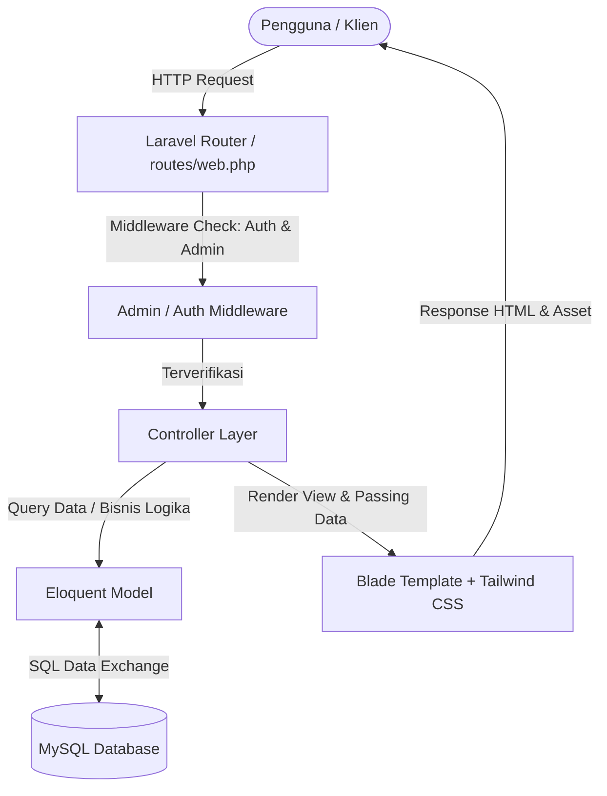
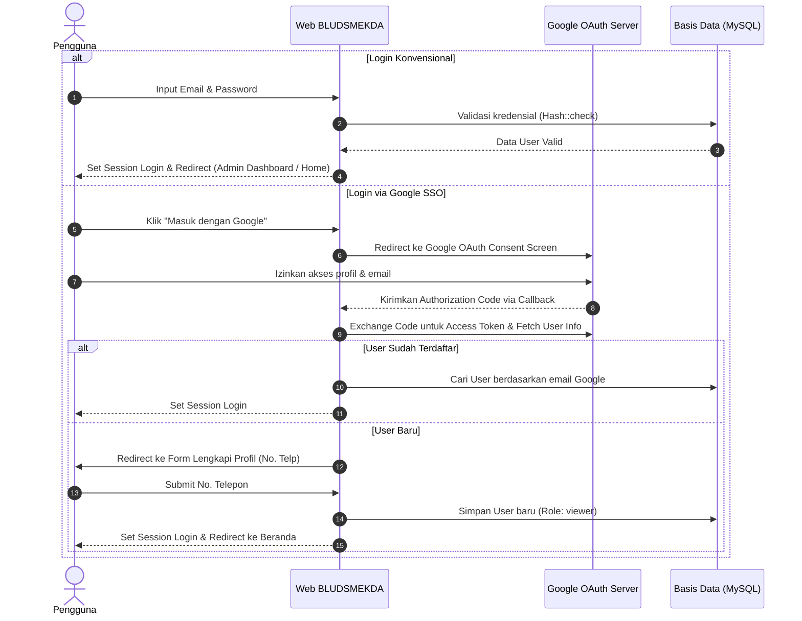

# Portal Web BLUD SMKN 2 Purwakarta (BLUDSMEKDA)

<p align="center">
  
</p>

<p align="center">
  
  
  
  
  
  
</p>

---

##  Daftar Isi
1. [Tentang Website](#-tentang-website)
2. [Fitur dan Isi Website](#-fitur-dan-isi-website)
   - [Halaman Publik (Public Portal)](#1-halaman-publik-public-portal)
   - [Sistem Autentikasi & Keamanan](#2-sistem-autentikasi--keamanan)
   - [Panel Administrasi (Admin Dashboard)](#3-panel-administrasi-admin-dashboard)
3. [Teknologi yang Digunakan (Tech Stack)](#-teknologi-yang-digunakan-tech-stack)
4. [Cara Kerja Sistem](#-cara-kerja-sistem)
   - [Arsitektur Aplikasi](#1-arsitektur-aplikasi)
   - [Alur Autentikasi Pengguna & SSO Google](#2-alur-autentikasi-pengguna--sso-google)
   - [Alur Pengelolaan Konten & Publikasi](#3-alur-pengelolaan-konten--publikasi)
   - [Alur Layanan Pesan & Kontak Pengunjung](#4-alur-layanan-pesan--kontak-pengunjung)
5. [Struktur Folder Proyek](#-struktur-folder-proyek)
6. [Panduan Instalasi & Menjalankan Proyek](#-panduan-instalasi--menjalankan-proyek)
7. [Akun Pengguna Default (Seeder)](#-akun-pengguna-default-seeder)
8. [Lisensi](#-lisensi)

---

## Tentang Website

**BLUDSMEKDA** adalah platform portal web resmi dan sistem informasi manajemen untuk **Badan Layanan Umum Daerah (BLUD) SMK Negeri 2 Purwakarta**. 

Website ini dirancang untuk:
1. **Transparansi & Informasi Publik**: Memperkenalkan profil sekolah, legalitas, visi misi, sarana prasarana, dan struktur organisasi BLUD kepada masyarakat luas.
2. **Komersialisasi Produk & Layanan Vokasi**: Mempublikasikan produk karya siswa, jasa profesional (seperti IT/website, percetakan, tata boga/layanan jasa lainnya), serta penyewaan fasilitas sekolah (lab komputer, gedung/aula, lapangan) dengan standar industri.
3. **Pemberitaan & Pengumuman**: Menyajikan kabar terkini, kegiatan pelatihan vokasi, artikel, dan informasi resmi secara berkala.
4. **Komunikasi Terpadu**: Menyediakan formulir pesan interaktif bagi masyarakat atau mitra industri untuk menghubungi pengelola BLUD secara langsung.

---

## Fitur dan Isi Website

Aplikasi ini terbagi menjadi dua bagian utama: **Portal Publik** untuk pengunjung umum dan **Panel Administrator** untuk pengelola BLUD.

### 1. Halaman Publik (Public Portal)
* **. Beranda (Home)**:
  - *Hero Section* modern dengan slogan dan tombol aksi cepat (*Call to Action*).
  - Ringkasan profil singkat dan keunggulan BLUD SMKN 2 Purwakarta.
  - *Showcase* layanan dan produk unggulan terpopuler.
  - Kartu berita & informasi terkini.
  - Integrasi lokasi sekolah dengan Google Maps interaktif.
* **. Profil Lembaga**:
  - Informasi identitas resmi BLUD (Dasar hukum, tahun berdiri, kontak resmi, alamat).
  - Sambutan Kepala Sekolah beserta foto pimpinan.
  - Sejarah dan latar belakang pembentukan BLUD.
  - Visi dan Misi sekolah/BLUD.
* **. Katalog Layanan & Produk**:
  - Menampilkan daftar produk/jasa yang ditawarkan BLUD (dengan sistem paginasi).
  - Filter dan pengelompokan berdasarkan kategori layanan.
  - **Halaman Detail Layanan**: Informasi rincian harga/tarif, estimasi durasi pengerjaan, persyaratan pemesanan, indikator layanan online/offline, dan rekomendasi layanan terkait.
* **. Fasilitas Sekolah**:
  - Menampilkan daftar sarana & prasarana yang dapat digunakan/disewa (misal: Lab Komputer, Aula, Lapangan Olahraga, Ruang Praktik).
  - Informasi kapasitas ruangan, jam operasional, dan lokasi gedung.
  - Status ketersediaan fasilitas (*Tersedia*, *Pemeliharaan*, atau *Tidak Tersedia*).
* **. Portal Berita & Artikel**:
  - Daftar artikel berita dan pengumuman dengan *thumbnail*, kategori, tanggal terbit, dan cuplikan ringkasan.
  - *Featured News* (Berita Utama).
  - **Halaman Baca Berita**: Tampilan artikel penuh berbasis rich-content dengan URL ramah SEO (*SEO Friendly Slug*) dan rekomendasi artikel terkait.
* **. Struktur Organisasi (Organigram)**:
  - Menampilkan bagan struktur pimpinan dan unit kerja BLUD secara hierarkis (Kepala Sekolah, Direktur, Wakil Direktur, Koordinator Bidang, dll.).
  - Kartu profil pejabat dilengkapi foto, nama lengkap, jabatan, divisi, dan NIP.
* **. Kontak Kami (Hubungi BLUD)**:
  - Informasi alamat kantor, jam operasional, nomor telepon, dan email resmi.
  - Formulir kirim pesan publik langsung ke database admin dengan validasi data nomor telepon dan email.

---

### 2. Sistem Autentikasi & Keamanan
* **Email & Password Login**: Login standar menggunakan enkripsi kata sandi `bcrypt`.
* **Google OAuth 2.0 Single Sign-On (SSO)**:
  - Pengguna dapat masuk atau mendaftar hanya dengan satu klik menggunakan akun Google.
  - Fitur pelengkap profil otomatis jika akun Google baru pertama kali mendaftar (pengisian nomor telepon).
* **Role-Based Access Control (RBAC)**:
  - `admin`: Memiliki akses penuh ke seluruh menu manajemen data pada dashboard admin.
  - `viewer`: Pengguna biasa/pengunjung terdaftar untuk interaksi publik.
* **Security & Middleware Protection**:
  - Middleware `admin` menjaga agar rute `/admin/*` tidak dapat diakses tanpa hak akses admin.
  - Proteksi anti-CSRF token pada seluruh form transaksi data.
  - Proteksi *Self-Delete Prevention* agar admin yang sedang login tidak dapat menghapus akunnya sendiri.
  - Fitur *Toggle Active/Inactive* untuk mengunci akun pengguna yang melanggar.

---

### 3. Panel Administrasi (Admin Dashboard)
Akses di URL `/admin/dashboard` yang dilengkapi sidebar navigasi dan desain UI responsif:

| Modul Admin | Deskripsi & Fungsi Fitur |
| :--- | :--- |
| **. Dashboard Ringkasan** | Ringkasan metrik statistik (Total Layanan, Layanan Aktif, Total Fasilitas, Fasilitas Tersedia, Total Berita, Berita Terbit, Pesan Belum Dibaca, Total Struktur Organisasi), grafik tren publikasi bulanan, daftar berita terbaru, dan pesan masuk terbaru. |
| **. Manajemen Berita** | Tambah, edit, hapus, dan cari berita. Pengaturan status publikasi (*Draft*, *Published*, *Archived*), auto-generate slug, upload gambar thumbnail, dan manajemen tags. |
| **. Manajemen Layanan** | Tambah, ubah, dan hapus layanan/produk. Pengaturan harga, durasi pengerjaan, syarat layanan, status online, serta tombol cepat *toggle active/inactive* via AJAX. |
| **. Manajemen Fasilitas** | Manajemen sarana prasarana sekolah, upload foto fasilitas, pengaturan lokasi, kapasitas, jam operasional, dan pembaruan status ketersediaan (*available*, *maintenance*, *unavailable*) via AJAX. |
| **. Manajemen Organigram** | Pengaturan bagan hierarki kepengurusan BLUD (Parent-Child Tree), upload foto pengurus, jabatan, NIP, serta urutan nomor tampilan. |
| **. Manajemen Profil BLUD** | Pengaturan informasi legalitas lembaga, nama instansi, visi & misi, sambutan kepala sekolah, foto sejarah, serta logo resmi BLUD. |
| **. Manajemen Pesan Kontak** | Melihat pesan masuk dari pengunjung, filter berdasarkan status pesan, aksi tandai telah dibaca (*Mark as Read*), dan tandai telah ditindaklanjuti/dibalas (*Mark as Replied*). |
| **. Manajemen Pengguna** | Tambah pengguna baru, ubah role (*Admin* / *Viewer*), atur password, aktifkan/nonaktifkan status akun, dan pencarian user. |
| **. Log Aktivitas Sistem** | Memantau seluruh rekaman aktivitas pengguna/admin, filter berdasarkan aksi dan rentang tanggal, serta fitur pembersihan log lama (> 30 hari). |

---

##  Teknologi yang Digunakan (Tech Stack)

### **Backend**
- **Bahasa Pemrograman**: [PHP 8.3+](https://www.php.net/)
- **Framework**: [Laravel 13.x](https://laravel.com/)
- **ORM**: Eloquent ORM (Relasi Database, Mutator, Query Scope)
- **Autentikasi**: Laravel Session Auth, Laravel Sanctum, Google OAuth API via Socialite Provider
- **Pustaka Pendukung**:
  - `cviebrock/eloquent-sluggable`: Pembuatan slug URL otomatis dan unik untuk artikel.
  - `socialiteproviders/google`: Integrasi Single Sign-On (SSO) Google.

### **Frontend**
- **Template Engine**: Laravel Blade Components & Layouts
- **CSS Framework**: [Tailwind CSS v4.0](https://tailwindcss.com/)
- **Bundler & Build Tool**: [Vite 8.0](https://vitejs.dev/) & `@tailwindcss/vite`
- **Animasi & Interaktivitas**:
  - [AOS (Animate On Scroll)](https://michalsnik.github.io/aos/) untuk efek animasi masuk yang halus.
  - JavaScript Vanilla / Fetch API untuk operasi interaktif AJAX (toggle status, update role, dll).

### **Database & Storage**
- **RDBMS**: [MySQL](https://www.mysql.com/) / MariaDB (Kompatibel dengan PostgreSQL dan SQLite).
- **File Storage**: Laravel Storage (`public` disk symbolic link) untuk file gambar logo, berita, fasilitas, layanan, dan foto pengurus.

---

##  Cara Kerja Sistem

### 1. Arsitektur Aplikasi
Aplikasi ini dibangun menggunakan pola arsitektur **MVC (Model-View-Controller)**:



---

### 2. Alur Autentikasi Pengguna & SSO Google



---

### 3. Alur Pengelolaan Konten & Publikasi
1. **Penyimpanan Berkas Media**: Setiap file gambar (logo sekolah, thumbnail berita, foto fasilitas, personil) diunggah melalui controller dan disimpan ke dalam direktori `storage/app/public/`, lalu diakses publik melalui symbolic link `public/storage/`.
2. **SEO Friendly Slugging**: Saat admin membuat judul berita, sistem secara otomatis menghasilkan string `slug` unik yang bersih untuk mempermudah pencarian di mesin pencari.
3. **Penyaringan Konten Publik**: Halaman publik hanya menampilkan data dengan status aktif (contoh: `status = 'published'` untuk berita, `status = 'active'` untuk layanan, dan `status = 'available'` untuk fasilitas).

---

### 4. Alur Layanan Pesan & Kontak Pengunjung
1. Pengunjung mengisi formulir pesan di halaman `/kontak` (Nama, Email, No. Telp, Subjek, Pesan).
2. Sistem memvalidasi keabsahan format nomor telepon dan email.
3. Data tersimpan di tabel `contact_messages` dengan status awal `new` (Belum dibaca).
4. Admin menerima notifikasi badge jumlah pesan belum dibaca di Dashboard Admin.
5. Saat admin membuka pesan, status otomatis berubah menjadi `read`. Setelah dihubungi lebih lanjut, admin dapat menandai status pesan menjadi `replied`.

---

##  Struktur Folder Proyek

Berikut adalah gambaran struktur direktori utama pada proyek ini:

```text
BLUDSMEKDA/
├── app/
│   ├── Http/
│   │   ├── Controllers/             # Controller logika bisnis aplikasi
│   │   │   ├── ActivityLogController.php
│   │   │   ├── AuthController.php
│   │   │   ├── ContactMessageController.php
│   │   │   ├── DashboardController.php
│   │   │   ├── FacilityController.php
│   │   │   ├── GoogleAuthController.php
│   │   │   ├── NewsController.php
│   │   │   ├── OrganigramController.php
│   │   │   ├── ProfileController.php
│   │   │   ├── PublicController.php
│   │   │   ├── ServiceController.php
│   │   │   └── UserController.php
│   │   └── Middleware/              # Middleware (AdminMiddleware, dsb.)
│   └── Models/                      # Model Eloquent (User, News, Service, Facility, dll.)
├── database/
│   ├── migrations/                  # Skema database tabel
│   └── seeders/                     # Seeder data awal (InitialDataSeeder, AdminUserSeeder)
├── public/                          # Public asset (css, js, images, storage symlink)
├── resources/
│   ├── css/                         # File sumber styling CSS
│   ├── js/                          # File sumber JavaScript
│   └── views/                       # Tampilan antarmuka Blade
│       ├── admin/                   # Template & tampilan panel admin
│       │   ├── contact-messages/
│       │   ├── facilities/
│       │   ├── news/
│       │   ├── organigrams/
│       │   ├── profiles/
│       │   ├── services/
│       │   ├── users/
│       │   └── dashboard.blade.php
│       ├── auth/                    # Tampilan login, register, lupa password, Google profile
│       ├── layouts/                 # Master layout (admin.blade.php & public.blade.php)
│       ├── partials/                # Partial views (navbar, footer, sidebar admin)
│       └── public/                  # Halaman publik (home, profile, services, news, contact, dll.)
├── routes/
│   └── web.php                      # Definisi rute web publik & admin
├── storage/                         # Log, session, dan penyimpanan file upload
├── composer.json                    # Dependensi paket PHP
├── package.json                     # Dependensi paket Node.js / Tailwind
├── vite.config.js                   # Konfigurasi bundling Vite
└── .env.example                     # Contoh konfigurasi environment
```

---

##  Panduan Instalasi & Menjalankan Proyek

Ikuti langkah-langkah di bawah ini untuk menjalankan proyek di lingkungan pengembangan lokal:

### 1. Prasyarat Sistem
Pastikan perangkat Anda telah terpasang:
- **PHP** >= 8.3
- **Composer** >= 2.x
- **Node.js** >= 18.x & **NPM**
- **MySQL Database Server** (via XAMPP, Laragon, Docker, atau standalone)
- **Git**

---

### 2. Langkah-Langkah Instalasi

#### **Langkah 1: Clone Repositori**
```bash
git clone https://github.com/zan-ux/BLUD_SMKN2PURWAKARTA.git
cd BLUDSMEKDA
```

#### **Langkah 2: Install Dependensi PHP (Composer)**
```bash
composer install
```

#### **Langkah 3: Salin File Environment & Generate App Key**
```bash
copy .env.example .env
php artisan key:generate
```
*(Gunakan `cp .env.example .env` jika menggunakan Linux/macOS)*

#### **Langkah 4: Konfigurasi Database di `.env`**
Buka file `.env` lalu sesuaikan konfigurasi koneksi database Anda:
```env
DB_CONNECTION=mysql
DB_HOST=127.0.0.1
DB_PORT=3306
DB_DATABASE=bludsmekda
DB_USERNAME=root
DB_PASSWORD=
```
> **Catatan**: Pastikan database `bludsmekda` sudah dibuat terlebih dahulu di MySQL/phpMyAdmin Anda.

#### **Langkah 5 (Opsional): Konfigurasi Google OAuth (SSO)**
Jika ingin mengaktifkan fitur *Login with Google*, tambahkan kredensial dari [Google Cloud Console](https://console.cloud.google.com/):
```env
GOOGLE_CLIENT_ID=your-google-client-id
GOOGLE_CLIENT_SECRET=your-google-client-secret
GOOGLE_REDIRECT_URI=http://127.0.0.1:8000/auth/google/callback
```

#### **Langkah 6: Jalankan Migrasi & Data Seeder**
Jalankan migrasi database beserta data awal (data dummy profil, layanan, fasilitas, berita, struktur organisasi, dan akun admin):
```bash
php artisan migrate --seed --seeder=InitialDataSeeder
```

#### **Langkah 7: Buat Symbolic Link Storage**
Agar berkas gambar yang diunggah dapat diakses oleh browser:
```bash
php artisan storage:link
```

#### **Langkah 8: Install & Build Asset Frontend**
```bash
npm install
npm run build
```

---

### 3. Menjalankan Server Lokal

Jalankan perintah berikut untuk menyalakan web server Laravel dan Vite secara bersamaan:

```bash
# Terminal 1: Menjalankan Laravel Development Server
php artisan serve

# Terminal 2: Menjalankan Vite Development Server (Hot Reload CSS & JS)
npm run dev
```

Buka peramban (browser) dan akses alamat:
```text
http://127.0.0.1:8000
```

---

##  Akun Pengguna Default (Seeder)

Setelah menjalankan `InitialDataSeeder`, Anda dapat login ke panel admin dengan akun default berikut:

| Role | Email | Password | Akses URL |
| :--- | :--- | :--- | :--- |
| **Administrator** | `admin@blud.com` | `password123` | [http://127.0.0.1:8000/login](http://127.0.0.1:8000/login) |

---

##  Lisensi

Proyek ini dikembangkan untuk kebutuhan operasional **Badan Layanan Umum Daerah (BLUD) SMKN 2 Purwakarta** dan dirilis di bawah lisensi [MIT License](LICENSE).
