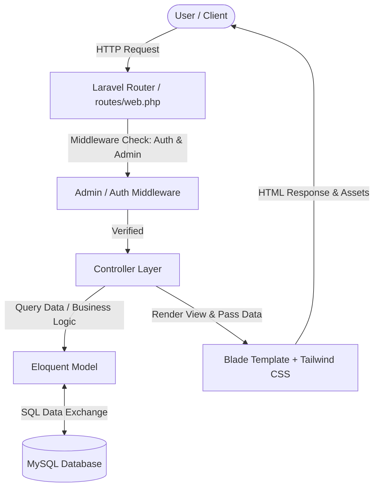
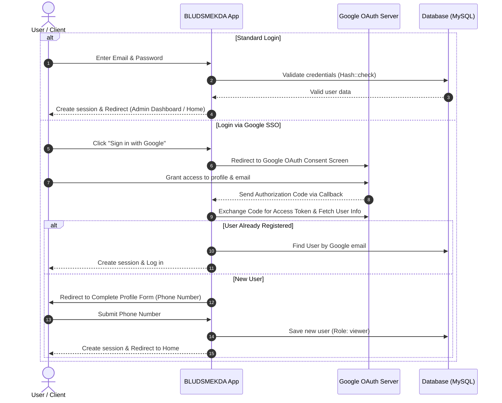

# BLUD SMKN 2 Purwakarta Web Portal (BLUDSMEKDA)

<p align="center">
  
</p>

<p align="center">
  
  
  
  
  
  
</p>

---

## Table of Contents
1. [About the Website](#about-the-website)
2. [Features and Content](#features-and-content)
   - [Public Portal](#1-public-portal)
   - [Authentication & Security System](#2-authentication--security-system)
   - [Administration Panel (Admin Dashboard)](#3-administration-panel-admin-dashboard)
3. [Tech Stack](#tech-stack)
4. [How the System Works](#how-the-system-works)
   - [Application Architecture](#1-application-architecture)
   - [User Authentication & Google SSO Flow](#2-user-authentication--google-sso-flow)
   - [Content Management & Publishing Workflow](#3-content-management--publishing-workflow)
   - [Visitor Contact & Messaging Workflow](#4-visitor-contact--messaging-workflow)
5. [Project Folder Structure](#project-folder-structure)
6. [Installation & Setup Guide](#installation--setup-guide)
7. [Default User Accounts (Seeder)](#default-user-accounts-seeder)
8. [Modular Technical Documentation](#modular-technical-documentation)
9. [License](#license)

---

## About the Website

**BLUDSMEKDA** is the official web portal platform and management information system for **Badan Layanan Umum Daerah (BLUD) SMK Negeri 2 Purwakarta**.

This website is designed for:
1. **Transparency & Public Information**: Introducing the school profile, legal basis, vision and mission, facilities, and the BLUD organizational structure to the public.
2. **Commercialization of Vocational Products & Services**: Promoting student-made products, professional vocational services (such as IT/web development, printing, culinary services, and other vocational business units), as well as facility rentals (computer labs, halls/auditoriums, sports fields) to industry standards.
3. **News & Announcements**: Delivering up-to-date news, vocational training activities, articles, and official announcements periodically.
4. **Integrated Communication**: Providing interactive contact forms for the general public or industrial partners to reach out to the BLUD management directly.

---

## Features and Content

The application is divided into two primary sections: the **Public Portal** for general visitors and the **Administrator Panel** for BLUD management staff.

### 1. Public Portal
* **Home Page**:
  - Modern *Hero Section* with taglines, value propositions, and quick Call-to-Action (CTA) buttons.
  - Brief institutional overview and core strengths of BLUD SMKN 2 Purwakarta.
  - *Showcase* of featured and popular vocational products & services.
  - Latest news & announcement cards.
  - Interactive school location via embedded Google Maps.
* **Institutional Profile**:
  - Official BLUD identity (Legal decree basis, founding year, official contact details, address).
  - Principal's welcoming speech and leadership portraits.
  - History and background of the BLUD formation.
  - School and BLUD Vision & Mission statements.
* **Services & Products Catalog**:
  - List of products and services offered by the BLUD (with pagination).
  - Filtering and grouping by service categories.
  - **Service Detail Page**: Pricing/rates information, estimated turnaround time, ordering requirements, online/offline service indicators, and related service recommendations.
* **School Facilities**:
  - List of facilities and infrastructure available for use/rental (e.g., Computer Labs, Auditorium/Hall, Sports Field, Practical Workshop Rooms).
  - Room capacity, operating hours, and building location details.
  - Real-time availability status (*Available*, *Maintenance*, or *Unavailable*).
* **News & Articles Portal**:
  - News and announcement list with thumbnails, categories, publication dates, and summary snippets.
  - *Featured News* highlight.
  - **News Article Page**: Rich-content article view with SEO-friendly slugs and related news recommendations.
* **Organizational Structure (Organigram)**:
  - Hierarchical tree chart of the BLUD management team (Principal, Director, Vice Director, Department Coordinators, etc.).
  - Personnel cards with formal photo, full name with academic titles, position, department, and Employee ID (NIP).
* **Contact Us**:
  - Office address, operating hours, telephone numbers, and official email.
  - Public contact submission form with input validation (phone number and email format).

---

### 2. Authentication & Security System
* **Email & Password Login**: Standard authentication using `bcrypt` password encryption.
* **Google OAuth 2.0 Single Sign-On (SSO)**:
  - Users can sign in or register with one click using their Google accounts.
  - Automated profile completion prompt for new Google SSO users (phone number input).
* **Role-Based Access Control (RBAC)**:
  - `admin`: Full access to all management modules on the admin dashboard.
  - `viewer`: Regular registered users/visitors for public portal interactions.
* **Security & Middleware Protection**:
  - `AdminMiddleware` protects all `/admin/*` routes from unauthorized access.
  - CSRF token protection on all state-mutating requests.
  - *Self-Delete Prevention* prevents the currently authenticated admin from deleting their own account.
  - *Toggle Active/Inactive* feature allows administrators to suspend problematic accounts instantly.

---

### 3. Administration Panel (Admin Dashboard)
Accessible at `/admin/dashboard`, featuring a responsive UI layout with a navigation sidebar:

| Admin Module | Description & Feature Highlights |
| :--- | :--- |
| **Summary Dashboard** | Statistical metrics overview (Total Services, Active Services, Total Facilities, Available Facilities, Total News, Published News, Unread Messages, Total Organigram Members), monthly publishing trend charts, latest published articles, and recent incoming messages. |
| **News Management** | Create, edit, delete, and search news articles. Publication status workflow (*Draft*, *Published*, *Archived*), automatic slug generation, thumbnail uploads, and tag management. |
| **Services Management** | Full CRUD for products and vocational services. Pricing, turnaround duration, ordering terms, online service availability, and quick AJAX active/inactive status toggles. |
| **Facilities Management** | School infrastructure management, photo uploads, location, capacity, operating hours, and quick AJAX status toggles (*available*, *maintenance*, *unavailable*). |
| **Organigram Management** | Hierarchical BLUD organizational tree structure (Parent-Child Tree), photo uploads, position, department, NIP, and display order indexing. |
| **BLUD Profile Management** | Legal status, institutional details, vision & mission, principal's greeting, historical documentation photo, and official BLUD logo. |
| **Contact Messages Inbox** | View incoming visitor inquiries, filter by handling status, mark as read (*Mark as Read*), and mark as responded (*Mark as Replied*). |
| **User Management** | Create new users, update user roles (*Admin* / *Viewer*), reset passwords, toggle account active status, and search users. |
| **System Activity Logs** | Real-time audit trail of user and admin activities, filtering by action type and date range, with a one-click purge tool for logs older than 30 days. |

---

## Tech Stack

### **Backend**
- **Programming Language**: [PHP 8.3+](https://www.php.net/)
- **Framework**: [Laravel 13.x](https://laravel.com/)
- **ORM**: Eloquent ORM (Relationships, Mutators, Query Scopes)
- **Authentication**: Laravel Session Auth, Laravel Sanctum, Google OAuth API via Socialite Provider
- **Supporting Packages**:
  - `cviebrock/eloquent-sluggable`: Automatic, unique URL slug generation for articles.
  - `socialiteproviders/google`: Google Single Sign-On (SSO) integration.

### **Frontend**
- **Template Engine**: Laravel Blade Components & Layouts
- **CSS Framework**: [Tailwind CSS v4.0](https://tailwindcss.com/)
- **Bundler & Build Tool**: [Vite 8.0](https://vitejs.dev/) & `@tailwindcss/vite`
- **Animations & Interactivity**:
  - [AOS (Animate On Scroll)](https://michalsnik.github.io/aos/) for smooth scroll-reveal animations.
  - Vanilla JavaScript / Fetch API for interactive AJAX operations (status toggles, role updates, etc.).

### **Database & Storage**
- **RDBMS**: [MySQL](https://www.mysql.com/) / MariaDB (Compatible with PostgreSQL and SQLite).
- **File Storage**: Laravel Storage (`public` disk symbolic link) for logos, news thumbnails, facility photos, service brochures, and personnel portraits.

---

## How the System Works

### 1. Application Architecture
The application is structured using the classic **MVC (Model-View-Controller)** architectural pattern:



---

### 2. User Authentication & Google SSO Flow



---

### 3. Content Management & Publishing Workflow
1. **Media File Storage**: Every uploaded media file (school logo, news thumbnail, facility photo, staff portrait) is processed by the respective controller and saved to `storage/app/public/`, accessible publicly via the `public/storage/` symbolic link.
2. **SEO-Friendly Slugging**: When creating a news article, the system automatically creates a clean, unique URL `slug` for optimal search engine indexing.
3. **Public Content Filtering**: Public pages only display active and published items (e.g., `status = 'published'` for news, `status = 'active'` for services, and `status = 'available'` for facilities).

---

### 4. Visitor Contact & Messaging Workflow
1. A visitor fills out the message form on `/kontak` (Name, Email, Phone, Subject, Message).
2. The system validates the input format (email syntax and phone number formatting).
3. The submission is saved to `contact_messages` with an initial status of `new` (Unread).
4. Administrators receive a real-time badge count of unread messages on the Admin Dashboard.
5. When an admin opens a message, its status automatically transitions to `read`. After responding, the admin can mark it as `replied`.

---

## Project Folder Structure

Overview of the core project structure:

```text
BLUDSMEKDA/
├── app/
│   ├── Http/
│   │   ├── Controllers/             # Application business logic controllers
│   │   │   ├── ActivityLogController.php
│   │   │   ├── AuthController.php
│   │   │   ├── ContactMessageController.php
│   │   │   ├── DashboardController.php
│   │   │   ├── FacilityController.php
│   │   │   ├── GoogleAuthController.php
│   │   │   ├── NewsController.php
│   │   │   ├── OrganigramController.php
│   │   │   ├── ProfileController.php
│   │   │   ├── PublicController.php
│   │   │   ├── ServiceController.php
│   │   │   └── UserController.php
│   │   └── Middleware/              # Middlewares (AdminMiddleware, etc.)
│   └── Models/                      # Eloquent Models (User, News, Service, Facility, etc.)
├── database/
│   ├── migrations/                  # Database schema migrations
│   └── seeders/                     # Initial database seeders (InitialDataSeeder, AdminUserSeeder)
├── public/                          # Public web root (css, js, images, storage symlink)
├── resources/
│   ├── css/                         # CSS styling source files
│   ├── js/                          # JavaScript source files
│   └── views/                       # Blade template views
│       ├── admin/                   # Admin panel views & templates
│       │   ├── contact-messages/
│       │   ├── facilities/
│       │   ├── news/
│       │   ├── organigrams/
│       │   ├── profiles/
│       │   ├── services/
│       │   ├── users/
│       │   └── dashboard.blade.php
│       ├── auth/                    # Auth views (login, register, forgot-password, Google profile)
│       ├── layouts/                 # Master layouts (admin.blade.php & public.blade.php)
│       ├── partials/                # Partial components (navbar, footer, admin sidebar)
│       └── public/                  # Public pages (home, profile, services, news, contact, etc.)
├── routes/
│   └── web.php                      # Public and admin web route definitions
├── storage/                         # Logs, sessions, and uploaded files storage
├── composer.json                    # PHP package dependencies
├── package.json                     # Node.js / Tailwind package dependencies
├── vite.config.js                   # Vite bundling configuration
└── .env.example                     # Environment configuration template
```

---

## Installation & Setup Guide

Follow these steps to set up and run the project in your local development environment:

### 1. System Requirements
Make sure your system has the following installed:
- **PHP** >= 8.3
- **Composer** >= 2.x
- **Node.js** >= 18.x & **NPM**
- **MySQL Database Server** (via Laragon, XAMPP, Docker, or standalone)
- **Git**

---

### 2. Step-by-Step Installation

#### **Step 1: Clone the Repository**
```bash
git clone https://github.com/zan-ux/BLUD_SMKN2PURWAKARTA.git
cd BLUDSMEKDA
```

#### **Step 2: Install PHP Dependencies (Composer)**
```bash
composer install
```

#### **Step 3: Copy Environment File & Generate Application Key**
```bash
copy .env.example .env
php artisan key:generate
```
*(Use `cp .env.example .env` on Linux/macOS)*

#### **Step 4: Configure Database in `.env`**
Open the `.env` file and adjust the database connection settings:
```env
DB_CONNECTION=mysql
DB_HOST=127.0.0.1
DB_PORT=3306
DB_DATABASE=bludsmekda
DB_USERNAME=root
DB_PASSWORD=
```
> **Note**: Ensure that the `bludsmekda` database has been created in MySQL / phpMyAdmin.

#### **Step 5 (Optional): Configure Google OAuth (SSO)**
To enable the *Sign in with Google* feature, add your credentials from the [Google Cloud Console](https://console.cloud.google.com/):
```env
GOOGLE_CLIENT_ID=your-google-client-id
GOOGLE_CLIENT_SECRET=your-google-client-secret
GOOGLE_REDIRECT_URI=http://127.0.0.1:8000/auth/google/callback
```

#### **Step 6: Run Database Migrations & Seeders**
Execute database migrations and populate default data (demo profiles, services, facilities, news, organizational structure, and admin accounts):
```bash
php artisan migrate --seed --seeder=InitialDataSeeder
```

#### **Step 7: Create the Storage Symbolic Link**
To make uploaded media files accessible via the browser:
```bash
php artisan storage:link
```

#### **Step 8: Install & Build Frontend Assets**
```bash
npm install
npm run build
```

---

### 3. Running the Local Server

Run the following commands in separate terminal windows to start both the Laravel server and Vite asset compiler:

```bash
# Terminal 1: Run Laravel Development Server
php artisan serve

# Terminal 2: Run Vite Development Server (Hot Reload for CSS & JS)
npm run dev
```

Open your browser and navigate to:
```text
http://127.0.0.1:8000
```

---

## Default User Accounts (Seeder)

After running `InitialDataSeeder`, you can log in to the admin dashboard using the default account:

| Role | Email | Password | Login URL |
| :--- | :--- | :--- | :--- |
| **Administrator** | `admin@blud.com` | `password123` | [http://127.0.0.1:8000/login](http://127.0.0.1:8000/login) |

---

## Modular Technical Documentation

For in-depth technical guides categorized by domain, please refer to the [`document/`](file:///c:/Users/zanrp/BLUDSMEKDA/document/README.md) directory:

- **[database.md](file:///c:/Users/zanrp/BLUDSMEKDA/document/database.md)**: Database schemas, ERD, Eloquent models, migrations & seeders.
- **[api.md](file:///c:/Users/zanrp/BLUDSMEKDA/document/api.md)**: Google OAuth 2.0 integration, Google Maps, & internal admin AJAX endpoints.
- **[auth.md](file:///c:/Users/zanrp/BLUDSMEKDA/document/auth.md)**: Traditional authentication, Google SSO, RBAC & Middleware protection.
- **[features.md](file:///c:/Users/zanrp/BLUDSMEKDA/document/features.md)**: Detailed feature specifications for the public portal & admin dashboard.
- **[architecture.md](file:///c:/Users/zanrp/BLUDSMEKDA/document/architecture.md)**: MVC pattern, directory structure, Vite + Tailwind v4 asset pipeline.
- **[setup.md](file:///c:/Users/zanrp/BLUDSMEKDA/document/setup.md)**: Step-by-step setup guide, Google Cloud Console setup & troubleshooting.

---

## License

This project was developed for the operational needs of **Badan Layanan Umum Daerah (BLUD) SMKN 2 Purwakarta**.
