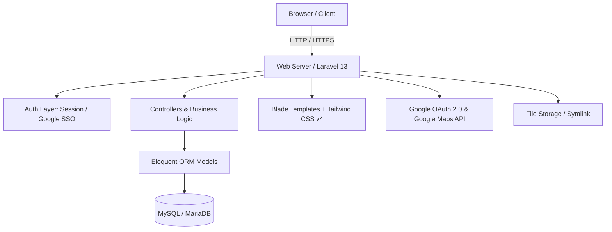

#  Dokumentasi Teknis BLUD SMKN 2 Purwakarta

Selamat datang di pusat dokumentasi teknis sistem informasi **BLUD SMKN 2 Purwakarta**. Dokumentasi ini disusun secara modular untuk mempermudah pengembang (*developer*), administrator sistem, dan pemangku kepentingan dalam memahami, mengelola, serta mengembangkan aplikasi ini.

---

##  Daftar Dokumen Teknis

Silakan pilih topik dokumentasi yang ingin dipelajari:

| No | Dokumen | Deskripsi Singkat | File Link |
|:--:|:---|:---|:---|
| 1 | **Database & Model** | Struktur basis data, skema tabel, relasi antar entitas, Model Eloquent, migrasi, dan data seeder. | [database.md](file:///c:/Users/zanrp/BLUDSMEKDA/document/database.md) |
| 2 | **API & Integrasi** | Integrasi API eksternal (Google OAuth 2.0, Google Maps) dan katalog REST/AJAX endpoint internal admin. | [api.md](file:///c:/Users/zanrp/BLUDSMEKDA/document/api.md) |
| 3 | **Autentikasi & Otorisasi** | Sistem login ganda (kredensial lokal & Google SSO), alur registrasi, RBAC (*admin* vs *viewer*), dan middleware keamanan. | [auth.md](file:///c:/Users/zanrp/BLUDSMEKDA/document/auth.md) |
| 4 | **Fitur & Spesifikasi** | Rincian fungsional seluruh halaman publik dan panel administrasi (CRUD, workflow konten, status interaktif). | [features.md](file:///c:/Users/zanrp/BLUDSMEKDA/document/features.md) |
| 5 | **Arsitektur Sistem** | Desain arsitektur MVC Laravel 13, frontend pipeline Vite + Tailwind CSS v4, struktur direktori, dan penanganan asset storage. | [architecture.md](file:///c:/Users/zanrp/BLUDSMEKDA/document/architecture.md) |
| 6 | **Setup & Panduan Instalasi** | Prasyarat sistem, langkah instalasi step-by-step, konfigurasi `.env`, setup Google Cloud Console OAuth, dan solusi troubleshooting. | [setup.md](file:///c:/Users/zanrp/BLUDSMEKDA/document/setup.md) |

---

##  Ringkasan Arsitektur & Teknologi

###  Ringkasan Tech Stack
- **Backend Framework**: Laravel 13 (PHP 8.3+)
- **Database**: MySQL / MariaDB
- **Frontend**: Blade Templating, Tailwind CSS v4, Vite 8, AOS (Animate On Scroll), SweetAlert2, FontAwesome 6
- **Integrasi**: Google OAuth 2.0 API, Google Maps Embed API
- **Autentikasi**: Laravel Session Auth & Google SSO OAuth 2.0

---

##  Navigasi Cepat
- Kembali ke halaman utama proyek: [README.md (Utama)](file:///c:/Users/zanrp/BLUDSMEKDA/README.md)
- Mulai instalasi aplikasi: [setup.md](file:///c:/Users/zanrp/BLUDSMEKDA/document/setup.md)
- Pelajari struktur database: [database.md](file:///c:/Users/zanrp/BLUDSMEKDA/document/database.md)
