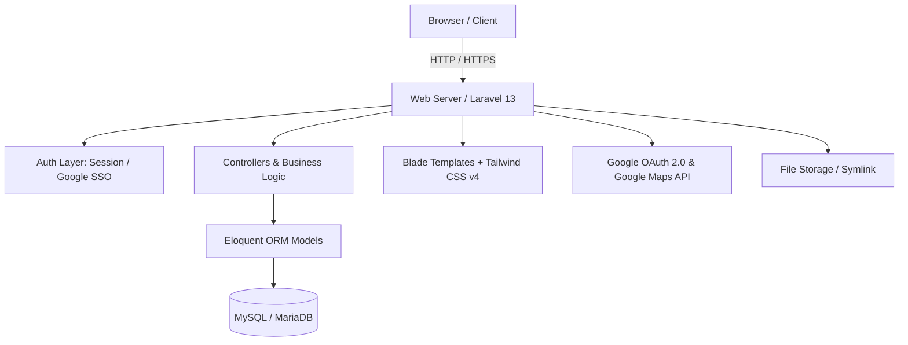

# BLUD SMKN 2 Purwakarta Technical Documentation

Welcome to the technical documentation hub for the **BLUD SMKN 2 Purwakarta** information system. This documentation is organized modularly to help developers, system administrators, and stakeholders understand, manage, and extend the application.

---

## Technical Documentation Directory

Please select a documentation topic to explore:

| No | Document | Overview | File Link |
|:--:|:---|:---|:---|
| 1 | **Database & Models** | Database structure, table schemas, entity relationships (ERD), Eloquent Models, migrations, and seeders. | [database.md](file:///c:/Users/zanrp/BLUDSMEKDA/document/database.md) |
| 2 | **API & Integrations** | External API integrations (Google OAuth 2.0, Google Maps) and internal admin REST/AJAX endpoint catalog. | [api.md](file:///c:/Users/zanrp/BLUDSMEKDA/document/api.md) |
| 3 | **Authentication & Authorization** | Dual login mechanisms (local credentials & Google SSO), registration flow, RBAC (*admin* vs *viewer*), and security middleware. | [auth.md](file:///c:/Users/zanrp/BLUDSMEKDA/document/auth.md) |
| 4 | **Features & Specifications** | Functional breakdown of all public portal and admin panel features (CRUD, content workflow, interactive states). | [features.md](file:///c:/Users/zanrp/BLUDSMEKDA/document/features.md) |
| 5 | **System Architecture** | Laravel 13 MVC architectural design, Vite + Tailwind CSS v4 frontend pipeline, directory layout, and file storage management. | [architecture.md](file:///c:/Users/zanrp/BLUDSMEKDA/document/architecture.md) |
| 6 | **Setup & Installation Guide** | System prerequisites, step-by-step installation, `.env` configuration, Google Cloud Console OAuth setup, and troubleshooting solutions. | [setup.md](file:///c:/Users/zanrp/BLUDSMEKDA/document/setup.md) |

---

## Architecture & Technology Summary

### Tech Stack Summary
- **Backend Framework**: Laravel 13 (PHP 8.3+)
- **Database**: MySQL / MariaDB
- **Frontend**: Blade Templating, Tailwind CSS v4, Vite 8, AOS (Animate On Scroll), SweetAlert2, FontAwesome 6
- **Integrations**: Google OAuth 2.0 API, Google Maps Embed API
- **Authentication**: Laravel Session Auth & Google SSO OAuth 2.0

---

## Quick Navigation
- Return to main project page: [README.md (Main)](file:///c:/Users/zanrp/BLUDSMEKDA/README.md)
- Start application installation: [setup.md](file:///c:/Users/zanrp/BLUDSMEKDA/document/setup.md)
- Explore database structure: [database.md](file:///c:/Users/zanrp/BLUDSMEKDA/document/database.md)
