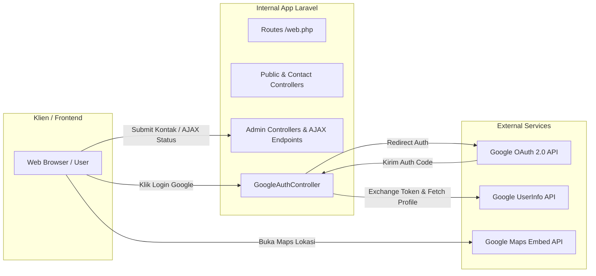

# 🌐 Dokumentasi API & Integrasi - BLUD SMKN 2 Purwakarta

Dokumen ini memuat spesifikasi integrasi antarmuka pemrograman aplikasi (**API**), baik API pihak ketiga (eksternal) maupun *Internal Endpoint / AJAX API* yang digunakan untuk interaktivitas dinamis pada sistem informasi **BLUD SMKN 2 Purwakarta**.

---

## 🗺️ 1. Peta Integrasi API



---

## 🔑 2. Integrasi API Eksternal

### 2.1. Google OAuth 2.0 API (Single Sign-On)
Digunakan untuk mengautentikasi pengguna secara aman menggunakan akun Google resmi tanpa perlu membuat kata sandi manual.

#### A. Authorization Endpoint
- **URL**: `https://accounts.google.com/o/oauth2/v2/auth`
- **Method**: `GET`
- **Controller Pengelola**: `App\Http\Controllers\GoogleAuthController::redirect()`
- **Parameter URL**:
  | Parameter | Tipe | Contoh Nilai | Keterangan |
  |---|---|---|---|
  | `client_id` | String | `123...apps.googleusercontent.com` | ID Klien OAuth dari Google Console |
  | `redirect_uri` | String | `http://localhost:8000/auth/google/callback` | URI pengalihan terdaftar |
  | `response_type` | String | `code` | Mengharapkan authorization code |
  | `scope` | String | `openid email profile` | Hak akses identitas, email, dan profil Google |

#### B. Token Exchange Endpoint
- **URL**: `https://oauth2.googleapis.com/token`
- **Method**: `POST`
- **Content-Type**: `application/x-www-form-urlencoded`
- **Controller Pengelola**: `App\Http\Controllers\GoogleAuthController::callback()`
- **Request Body**:
  ```json
  {
    "client_id": "GOOGLE_CLIENT_ID",
    "client_secret": "GOOGLE_CLIENT_SECRET",
    "code": "4/0AdLIrYe...",
    "grant_type": "authorization_code",
    "redirect_uri": "GOOGLE_REDIRECT_URI"
  }
  ```
- **Response Contoh**:
  ```json
  {
    "access_token": "ya29.a0AfH6SM...",
    "expires_in": 3599,
    "token_type": "Bearer",
    "scope": "openid https://www.googleapis.com/auth/userinfo.email https://www.googleapis.com/auth/userinfo.profile",
    "id_token": "eyJhbGciOiJSUzI1NiIs..."
  }
  ```

#### C. User Profile Endpoint
- **URL**: `https://www.googleapis.com/oauth2/v2/userinfo`
- **Method**: `GET`
- **Headers**:
  ```http
  Authorization: Bearer ya29.a0AfH6SM...
  ```
- **Response Contoh**:
  ```json
  {
    "id": "1049283748291029384",
    "email": "siswa@smkn2purwakarta.sch.id",
    "verified_email": true,
    "name": "Budi Santoso",
    "given_name": "Budi",
    "family_name": "Santoso",
    "picture": "https://lh3.googleusercontent.com/a/ACg8oc...",
    "locale": "id"
  }
  ```

---

### 2.2. Google Maps Embed API
Digunakan pada halaman **Kontak** (`/kontak`) dan **Profil** (`/profil`) untuk menampilkan denah satelit lokasi SMKN 2 Purwakarta.

- **URL Dasar**: `https://www.google.com/maps/embed/v1/place` atau iframe standar Google Maps.
- **Koordinat**: `SMK Negeri 2 Purwakarta (Jl. Jend. Ahmad Yani No.98, Cipaising, Kec. Purwakarta, Kabupaten Purwakarta, Jawa Barat 41113)`
- **Format Tampilan**: Iframe responsif dengan styling rounded dan shadow modern.

---

## ⚡ 3. Katalog Internal REST & AJAX Endpoints

Sistem menyediakan sejumlah endpoint internal untuk menangani interaksi frontend asinkron (AJAX) dan RESTful CRUD.

### 3.1. Struktur Organisasi Tree API
Mengambil data susunan struktur organisasi dalam format pohon bertingkat (*hierarchical JSON tree*).

- **Route**: `GET /admin/organigrams-tree`
- **Middleware**: `auth`, `admin`
- **Response Status**: `200 OK`
- **Contoh Response JSON**:
  ```json
  [
    {
      "id": 1,
      "name": "Drs. H. Pimpinan BLUD, M.Pd",
      "position": "Kepala BLUD / Kepala Sekolah",
      "department": "Pimpinan Utama",
      "photo": "/storage/organigram/kepala.jpg",
      "children": [
        {
          "id": 2,
          "name": "Ahmad Subagja, S.T",
          "position": "Ketua Unit Produksi",
          "department": "Divisi Jasa & Produksi",
          "parent_id": 1,
          "children": []
        }
      ]
    }
  ]
  ```

---

### 3.2. Toggle Status Fasilitas
Mengubah status ketersediaan sarana/prasarana secara instan melalui switch toggle.

- **Route**: `PATCH /admin/facilities/{facility}/status`
- **Headers**:
  ```http
  X-CSRF-TOKEN: {csrf_token}
  Content-Type: application/json
  Accept: application/json
  ```
- **Request Body**:
  ```json
  {
    "status": "available" 
  }
  ```
  *(Pilihan status: `available`, `maintenance`, `unavailable`)*
- **Response**:
  ```json
  {
    "success": true,
    "message": "Status fasilitas berhasil diperbarui.",
    "new_status": "available"
  }
  ```

---

### 3.3. Toggle Status Layanan Unit Usaha
Mengaktifkan atau menonaktifkan visibilitas produk/jasa ke portal publik.

- **Route**: `PATCH /admin/services/{service}/status`
- **Headers**: `X-CSRF-TOKEN`, `Content-Type: application/json`
- **Request Body**:
  ```json
  {
    "status": "active"
  }
  ```
  *(Pilihan: `active`, `inactive`)*
- **Response**:
  ```json
  {
    "success": true,
    "message": "Status layanan berhasil diperbarui.",
    "new_status": "active"
  }
  ```

---

### 3.4. Manajemen Pengguna (User Management AJAX)

#### A. Ubah Status Aktif Pengguna
- **Route**: `PATCH /admin/users/{user}/toggle-active`
- **Response**:
  ```json
  {
    "success": true,
    "is_active": false,
    "message": "Status akun berhasil dinonaktifkan."
  }
  ```

#### B. Ubah Peran (Role) Pengguna
- **Route**: `PATCH /admin/users/{user}/role`
- **Request Body**:
  ```json
  {
    "role": "admin"
  }
  ```
  *(Pilihan: `admin`, `viewer`)*
- **Response**:
  ```json
  {
    "success": true,
    "message": "Role pengguna berhasil diubah ke admin."
  }
  ```

---

### 3.5. Manajemen Pesan Kontak (Contact Inbox)

#### A. Tandai Pesan Telah Dibaca
- **Route**: `PATCH /admin/contact-messages/{contactMessage}/read`
- **Response**:
  ```json
  {
    "success": true,
    "status": "read"
  }
  ```

#### B. Tandai Pesan Telah Dibalas
- **Route**: `PATCH /admin/contact-messages/{contactMessage}/replied`
- **Response**:
  ```json
  {
    "success": true,
    "status": "replied"
  }
  ```

---

### 3.6. Pembersihan Log Aktivitas (Clear Activity Logs)
Menghapus riwayat audit log aktivitas yang sudah kadaluwarsa (lebih lama dari 30 hari).

- **Route**: `DELETE /admin/activity-logs/clear`
- **Response**:
  ```json
  {
    "success": true,
    "message": "Sebanyak 142 log aktivitas lama berhasil dibersihkan."
  }
  ```

---

### 3.7. Formulir Pengiriman Pesan Kontak Publik
Menerima pesan pertanyaan atau penawaran kerjasama dari pengunjung umum.

- **Route**: `POST /kontak`
- **Headers**: Form Data / Multi-part
- **Request Body**:
  | Field | Validasi | Keterangan |
  |---|---|---|
  | `name` | `required\|string\|max:255` | Nama lengkap |
  | `email` | `required\|email\|max:255` | Email aktif |
  | `phone` | `required\|string\|max:20` | No. WhatsApp/Telepon |
  | `subject` | `required\|string\|max:255` | Subjek pesan |
  | `message` | `required\|string` | Isi pesan |
- **Response**: Redirect back dengan session flash message `success`.
