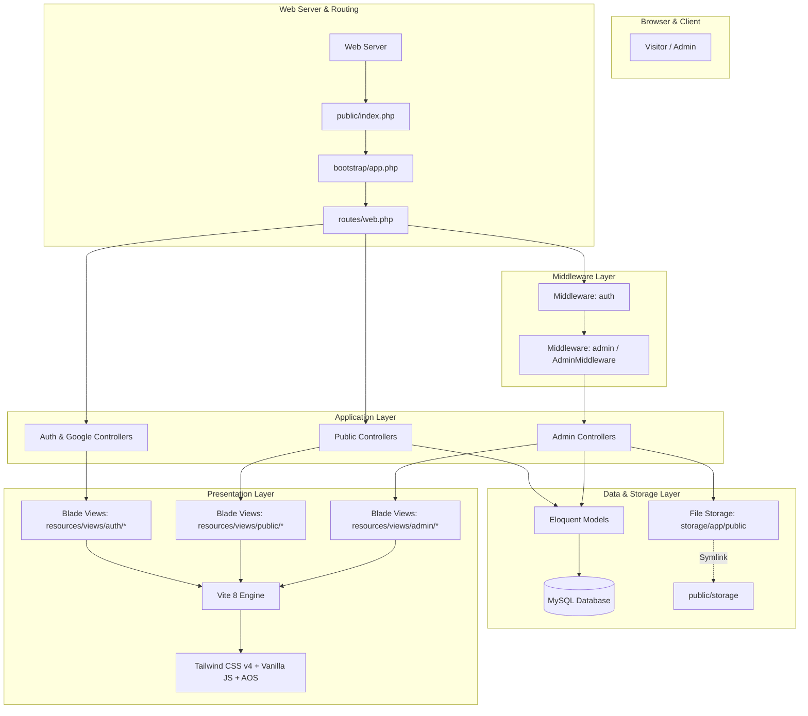

# System Architecture Documentation - BLUD SMKN 2 Purwakarta

This document outlines the software architecture, directory structure, *Model-View-Controller (MVC)* design pattern, *asset bundling pipeline* using Vite + Tailwind CSS v4, and media file storage management in the **BLUD SMKN 2 Purwakarta** system.

---

## 1. High-Level Architecture Diagram



---

## 2. Project Directory Structure

The project's root folder is structured modularly following modern Laravel 13 standards:

```text
c:\Users\zanrp\BLUDSMEKDA\
├── app/                              # Core backend application logic
│   ├── Http/
│   │   ├── Controllers/             # 15 Controllers (Public, Admin, Auth, Google, etc.)
│   │   └── Middleware/              # Custom Middlewares (AdminMiddleware)
│   ├── Models/                      # 11 Eloquent Models (User, Profile, Service, etc.)
│   └── Providers/                   # Application Service Providers
├── bootstrap/                        # Bootstrapping & framework runtime configuration
├── config/                           # Application configuration (auth, database, filesystems, etc.)
├── database/                         # Migrations, Seeders, and Factories
│   ├── migrations/                  # 18 table schema migration files
│   └── seeders/                     # Initial seeders for institution data & demo admin
├── document/                         # Modular technical documentation (This directory)
│   ├── README.md                    # Documentation index & navigation map
│   ├── api.md                       # External & internal API specifications
│   ├── architecture.md              # System architecture & code structure
│   ├── auth.md                      # Authentication, Google SSO & RBAC authorization
│   ├── database.md                  # Database schema, ERD, models & seeders
│   ├── features.md                  # Public portal & admin dashboard feature details
│   └── setup.md                     # Installation guide & environment configuration
├── public/                           # Public web root (index.php, logo, storage symlink)
│   └── storage -> ../storage/app/public
├── resources/                        # Raw frontend assets & view templates
│   ├── css/
│   │   └── app.css                  # Tailwind CSS v4 configuration & custom stylesheets
│   ├── js/
│   │   └── app.js                   # Main JavaScript module & AJAX integrations
│   └── views/                       # Blade UI templates
│       ├── admin/                   # Admin panel views (dashboard, CRUD, users)
│       ├── auth/                    # Auth views (login, register, password reset, Google SSO)
│       ├── components/              # Reusable Blade components (navbar, footer, cards)
│       ├── layouts/                 # Base layout wrappers (app.blade.php, admin.blade.php)
│       └── public/                  # Public pages (home, profile, services, facilities, etc.)
├── routes/
│   ├── console.php                  # Custom Artisan CLI commands
│   └── web.php                      # Application web & API route definitions
├── storage/                         # Log, cache, and uploaded media file storage
│   └── app/public/                  # Photos of services, facilities, news, & user avatars
├── .env                              # Local environment configuration (DB, OAuth, App Key)
├── composer.json                     # PHP / Composer package dependencies
├── package.json                      # Node.js / NPM frontend package dependencies
├── README.md                         # General project documentation (Root)
└── vite.config.js                    # Vite bundler configuration
```

---

## 3. Frontend Asset Pipeline (Vite + Tailwind CSS v4)

The system utilizes the latest frontend build tooling: **Vite 8** combined with **Tailwind CSS v4** (`@tailwindcss/vite`).

### 3.1. `vite.config.js` Configuration
```javascript
import { defineConfig } from 'vite';
import laravel from 'laravel-vite-plugin';
import tailwindcss from '@tailwindcss/vite';

export default defineConfig({
    plugins: [
        laravel({
            input: ['resources/css/app.css', 'resources/js/app.js'],
            refresh: true,
        }),
        tailwindcss(),
    ],
});
```

### 3.2. Frontend Feature Highlights
- **Tailwind CSS v4**: Next-generation CSS engine with instantaneous compilation without the need for complex `tailwind.config.js` configuration.
- **Glassmorphism & Micro-Interactions**: Modern components with backdrop blur (`backdrop-blur`), floating card hover states (*hover lift*), and smooth transitions.
- **AOS (Animate On Scroll)**: Provides responsive scroll-reveal entry animations as the user navigates down the page.
- **SweetAlert2**: Interactive confirmation popups for critical actions like data deletion, status toggles, and form feedback.
- **FontAwesome 6**: Sharp vector iconography across all menus and UI elements.

---

## 4. File Management & Media Storage

Uploaded files (such as institutional logos, principal photos, service brochures, workshop photos, and news images) are securely stored in `storage/app/public/`.

### 4.1. Upload Folder Structure (`storage/app/public/`)
```text
storage/app/public/
├── profiles/         # Institutional logo, history photos, principal's greeting photo
├── services/         # Vocational service brochures and product photos
├── facilities/       # Photos of computer labs, sports courts, and workshops
├── news/             # News cover images and article header photos
├── gallery/          # Supplemental event photo gallery for news articles
├── organigram/       # Official personnel portraits for the BLUD organizational tree
└── avatars/          # User profile photos
```

### 4.2. Upload Handling Pattern in Controllers
```php
if ($request->hasFile('image')) {
    // 1. Delete old image if a replacement file is provided
    if ($service->image && Storage::disk('public')->exists($service->image)) {
        Storage::disk('public')->delete($service->image);
    }
    
    // 2. Store new image in 'services' directory on the 'public' disk
    $validatedData['image'] = $request->file('image')->store('services', 'public');
}
```

### 4.3. Symbolic Link (*Symlink*)
To allow files stored in the private `storage/app/public/` directory to be served by web browsers via the `/storage/...` URL, a symbolic link is generated using:
```bash
php artisan storage:link
```
This maps the `public/storage` directory directly to `storage/app/public`.
