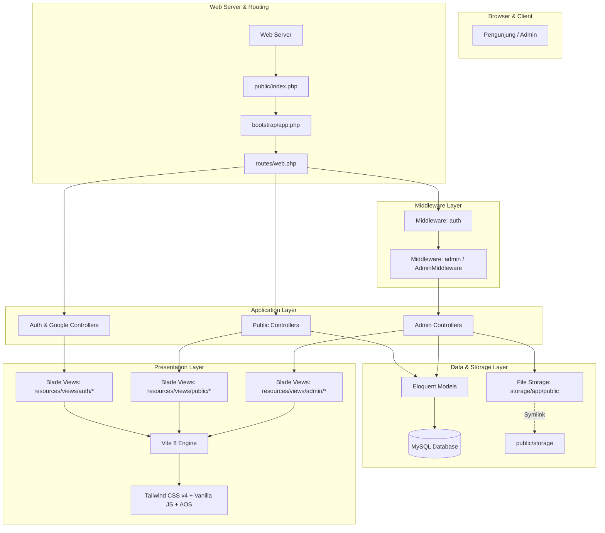

#  Dokumentasi Arsitektur Sistem - BLUD SMKN 2 Purwakarta

Dokumen ini menguraikan arsitektur perangkat lunak, struktur direktori, pola desain *Model-View-Controller (MVC)*, *asset bundling pipeline* menggunakan Vite + Tailwind CSS v4, serta manajemen penyimpanan media berkas pada sistem **BLUD SMKN 2 Purwakarta**.

---

##  1. Diagram Arsitektur Tingkat Tinggi



---

##  2. Struktur Direktori Proyek

Struktur folder utama proyek diatur secara modular sesuai standar modern Laravel 13:

```text
c:\Users\zanrp\BLUDSMEKDA\
├── app/                              # Inti logika backend aplikasi
│   ├── Http/
│   │   ├── Controllers/             # 15 Controller (Public, Admin, Auth, Google, dll.)
│   │   └── Middleware/              # Middleware kustom (AdminMiddleware)
│   ├── Models/                      # 11 Model Eloquent (User, Profile, Service, dll.)
│   └── Providers/                   # Service Providers aplikasi
├── bootstrap/                        # Bootstrapping & konfigurasi runtime framework
├── config/                           # Konfigurasi aplikasi (auth, database, filesystems, dll.)
├── database/                         # Migrasi, Seeder, dan Factory
│   ├── migrations/                  # 18 berkas migrasi skema tabel
│   └── seeders/                     # Seeder data awal instansi & admin demo
├── document/                         # 📚 Dokumentasi teknis modular sistem (Folder ini)
│   ├── README.md                    # Indeks & peta navigasi dokumen
│   ├── api.md                       # Spesifikasi API eksternal & internal
│   ├── architecture.md              # Arsitektur sistem & struktur kode
│   ├── auth.md                      # Autentikasi, Google SSO & otorisasi RBAC
│   ├── database.md                  # Skema database, ERD, model & seeder
│   ├── features.md                  # Rincian fitur portal publik & admin
│   └── setup.md                     # Panduan instalasi & konfigurasi environment
├── public/                           # Web root publik (index.php, logo, storage symlink)
│   └── storage -> ../storage/app/public
├── resources/                        # Aset frontend mentah & view templates
│   ├── css/
│   │   └── app.css                  # Konfigurasi Tailwind CSS v4 & custom stylesheet
│   ├── js/
│   │   └── app.js                   # Modul JavaScript utama & integrasi AJAX
│   └── views/                       # Template tampilan Blade
│       ├── admin/                   # Tampilan panel admin (dashboard, CRUD, users)
│       ├── auth/                    # Tampilan login, register, lupa password, Google SSO
│       ├── components/              # Komponen reusable Blade (navbar, footer, cards)
│       ├── layouts/                 # Layout dasar (app.blade.php, admin.blade.php)
│       └── public/                  # Halaman publik (home, profil, layanan, fasilitas, dll.)
├── routes/
│   ├── console.php                  # Perintah Artisan CLI kustom
│   └── web.php                      # Definisi seluruh rute web & API aplikasi
├── storage/                          # Direktori penyimpanan log, cache, dan unggahan berkas
│   └── app/public/                  # Berkas foto layanan, fasilitas, berita, & avatar
├── .env                              # Konfigurasi environment lokal (DB, OAuth, App Key)
├── composer.json                     # Daftar pustaka PHP / Composer
├── package.json                      # Daftar pustaka Frontend Node.js / NPM
├── README.md                         # Dokumentasi umum proyek (Root)
└── vite.config.js                    # Konfigurasi bundler Vite
```

---

##  3. Frontend Asset Pipeline (Vite + Tailwind CSS v4)

Sistem menggunakan standar bundler frontend terkini: **Vite 8** yang dipadukan dengan **Tailwind CSS v4** (`@tailwindcss/vite`).

### 3.1. Konfigurasi `vite.config.js`
```javascript
import { defineConfig } from 'vite';
import laravel from 'laravel-vite-plugin';
import tailwindcss from '@tailwindcss/vite';

export default defineConfig({
    plugins: [
        laravel({
            input: ['resources/css/app.css', 'resources/js/app.js'],
            refresh: true,
        }),
        tailwindcss(),
    ],
});
```

### 3.2. Fitur Unggulan Frontend
- **Tailwind CSS v4**: Engine generasi baru berbasis kompilasi instan tanpa konfigurasi `tailwind.config.js` yang rumit.
- **Glassmorphism & Micro-Interactions**: Komponen modern dengan efek latar blur (`backdrop-blur`), kartu mengambang (*hover lift*), dan transisi halus.
- **AOS (Animate On Scroll)**: Menghadirkan efek animasi masuk (*reveal animation*) yang responsif saat pengguna menggulir halaman.
- **SweetAlert2**: Notifikasi pop-up konfirmasi interaktif untuk aksi krusial seperti hapus data, status toggle, dan feedback form.
- **FontAwesome 6**: Ikonografi vektor tajam untuk setiap menu dan elemen interaktif.

---

##  4. Manajemen Berkas & Media Storage

Berkas unggahan (seperti logo instansi, foto kepala sekolah, brosur layanan, foto bengkel/fasilitas, dan gambar berita) disimpan secara terisolasi pada `storage/app/public/`.

### 4.1. Struktur Folder Unggahan (`storage/app/public/`)
```text
storage/app/public/
├── profiles/         # Logo instansi, foto sejarah, foto sambutan kepala sekolah
├── services/         # Foto/brosur produk dan jasa kejuruan
├── facilities/       # Foto ruangan laboratorium dan bengkel kerja
├── news/             # Gambar sampul warta dan artikel
├── gallery/          # Dokumentasi foto kegiatan tambahan pada berita
├── organigram/       # Pas foto resmi pejabat struktural BLUD
└── avatars/          # Foto profil pengguna
```

### 4.2. Pola Penanganan Unggahan pada Controller
```php
if ($request->hasFile('image')) {
    // 1. Hapus gambar lama jika ada pergantian berkas
    if ($service->image && Storage::disk('public')->exists($service->image)) {
        Storage::disk('public')->delete($service->image);
    }
    
    // 2. Simpan gambar baru ke folder 'services' di disk 'public'
    $validatedData['image'] = $request->file('image')->store('services', 'public');
}
```

### 4.3. Symbolic Link (*Symlink*)
Agar berkas dalam folder privat `storage/app/public/` dapat diakses langsung oleh browser publik melalui URL `/storage/...`, dibuat symlink menggunakan perintah:
```bash
php artisan storage:link
```
Perintah ini menghubungkan folder `public/storage` langsung ke direktori `storage/app/public`.
