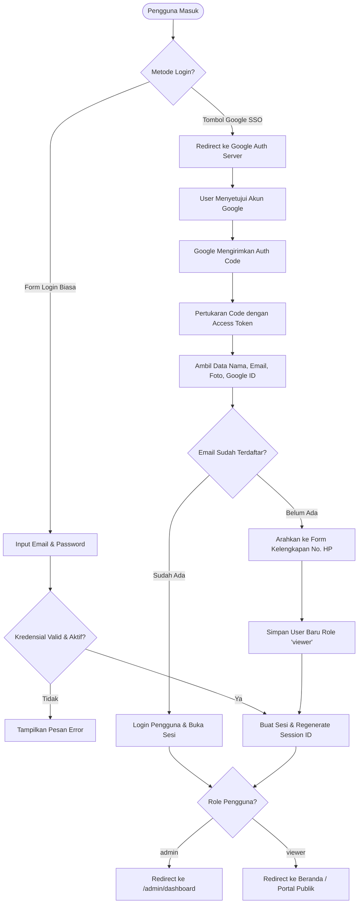

# 🔐Dokumentasi Autentikasi & Otorisasi - BLUD SMKN 2 Purwakarta

Dokumen ini menjelaskan mekanisme keamanan autentikasi pengguna (*authentication*), integrasi Google Single Sign-On (OAuth 2.0), kontrol hak akses berbasis peran (*Role-Based Access Control / RBAC*), dan proteksi middleware pada sistem informasi **BLUD SMKN 2 Purwakarta**.

---

##  1. Arsitektur Keamanan Pengguna

Sistem mengadopsi skema autentikasi ganda (*Hybrid Authentication*):
1. **Autentikasi Tradisional**: Berbasis kombinasi email dan kata sandi lokal terenkripsi *Bcrypt Hash*.
2. **Google OAuth 2.0 Single Sign-On (SSO)**: Mengizinkan login dan registrasi cepat menggunakan akun Google (khususnya email resmi sekolah atau umum).



---

## 🚀 2. Alur Integrasi Google OAuth 2.0 (SSO)

Pengelolaan Google SSO ditangani secara modular oleh `App\Http\Controllers\GoogleAuthController`:

### Langkah 1: Pengalihan Klien (`redirect()`)
Saat pengguna menekan tombol *"Masuk dengan Google"*, controller membangun query URL otorisasi resmi Google:
```php
$query = http_build_query([
    'client_id' => env('GOOGLE_CLIENT_ID'),
    'redirect_uri' => env('GOOGLE_REDIRECT_URI'),
    'response_type' => 'code',
    'scope' => 'openid email profile',
]);
return redirect('https://accounts.google.com/o/oauth2/v2/auth?' . $query);
```

### Langkah 2: Penerimaan Callback & Pertukaran Token (`callback()`)
Google mengembalikan `code` otorisasi ke URL redirect `http://localhost:8000/auth/google/callback`. Controller mengirimkan HTTP POST ke endpoint Google Token:
- **Token Endpoint**: `https://oauth2.googleapis.com/token`
- **Userinfo Endpoint**: `https://www.googleapis.com/oauth2/v2/userinfo`

### Langkah 3: Penanganan Profil & Registrasi Akun Baru
1. **User Lama**: Jika email dari Google sudah ada di tabel `users`, sistem langsung melakukan login otomatis (`Auth::login($existingUser)`).
2. **User Baru**: Jika email belum ada di database:
   - Data sementara (`name`, `email`, `avatar`, `google_id`) disimpan di session sementara `Session::put('google_user', ...)`.
   - Pengguna diarahkan ke form kelengkapan nomor telepon aktif (`/google/complete-profile`).
   - Setelah input nomor HP valid, user baru disimpan dengan password acak aman (*random 24 char hash*) dan role bawaan `viewer`.

---

## 🔑 3. Alur Autentikasi Tradisional (Lokal)

Pengelolaan autentikasi manual ditangani oleh `App\Http\Controllers\AuthController`:

### 3.1. Registrasi Akun (`/register`)
- **Validasi Input**:
  - `name`: Wajib, teks maksimal 255 karakter.
  - `email`: Wajib, format email valid, unik di tabel `users`.
  - `phone`: Wajib, format nomor telepon Indonesia (`08...` atau `+62...`).
  - `password`: Wajib, minimal 8 karakter, harus sama dengan `password_confirmation`.
- **Enkripsi**: Password di-hash menggunakan algoritma `Hash::make()` (Bcrypt).
- **Default Role**: Akun baru otomatis memperoleh peran `viewer` dan status `is_active = true`.

### 3.2. Login Pengguna (`/login`)
- **Pengecekan Kredensial**: `Auth::attempt(['email' => $email, 'password' => $password], $remember)`.
- **Validasi Akun Aktif**: Jika `is_active === false`, login ditolak dan muncul pesan peringatan bahwa akun dinonaktifkan oleh administrator.
- **Proteksi Session Fixation**: Menjalankan `$request->session()->regenerate()` setiap kali login berhasil untuk mencegah pencurian token sesi.

### 3.3. Logout Pengguna (`/logout`)
- Menjalankan `Auth::logout()`.
- Menghapus seluruh sesi aktif `$request->session()->invalidate()`.
- Menghasilkan token CSRF baru `$request->session()->regenerateToken()` untuk keamanan berikutnya.

---

## 👥 4. Role-Based Access Control (RBAC)

Sistem menerapkan dua level hak akses (*Role*):

| Peran (Role) | Hak Akses Portal Publik | Hak Akses Dashboard Admin | Fitur Khusus |
|---|:---:|:---:|---|
| **`admin`** | ✅ Ya | ✅ Ya (`/admin/*`) | Akses penuh: Kelola profil BLUD, CRUD layanan, fasilitas, berita, struktur organigram, kelola akun pengguna, ubah role, dan audit log. |
| **`viewer`** | ✅ Ya | ❌ Ditolak (403 Forbidden) | Mengakses portal informasi publik, membaca berita, melihat katalog layanan/fasilitas, dan mengirimkan pesan kontak. |

---

## 🚧 5. Middleware & Proteksi Keamanan

### 5.1. `AdminMiddleware` (`app/Http/Middleware/AdminMiddleware.php`)
Diterapkan pada grup route `/admin/*`. Memeriksa dua kondisi:
1. **Autentikasi**: `Auth::check()` — Memastikan pengguna sudah login. Jika belum, dialihkan ke `/login`.
2. **Otorisasi**: `Auth::user()->isAdmin()` — Memeriksa apakah kolom `role === 'admin'`. Jika bukan admin, sistem langsung menghentikan request dengan status `403 Forbidden`.

```php
public function handle(Request $request, Closure $next)
{
    if (!Auth::check()) {
        return redirect()->route('login');
    }

    if (!Auth::user()->isAdmin()) {
        abort(403, 'Anda tidak memiliki akses ke halaman admin.');
    }

    return $next($request);
}
```

### 5.2. Proteksi Admin Self-Delete
Pada `UserController::destroy()`, sistem memvalidasi agar admin yang sedang login tidak dapat menghapus akunnya sendiri:
```php
if ($user->id === Auth::id()) {
    return back()->with('error', 'Anda tidak dapat menghapus akun Anda sendiri.');
}
```

### 5.3. Proteksi CSRF (Cross-Site Request Forgery)
Seluruh request mutasi data (`POST`, `PUT`, `PATCH`, `DELETE`) dilindungi oleh token CSRF Laravel melalui direktif `@csrf` pada formulir HTML dan header `X-CSRF-TOKEN` pada pemanggilan AJAX/Fetch API.
