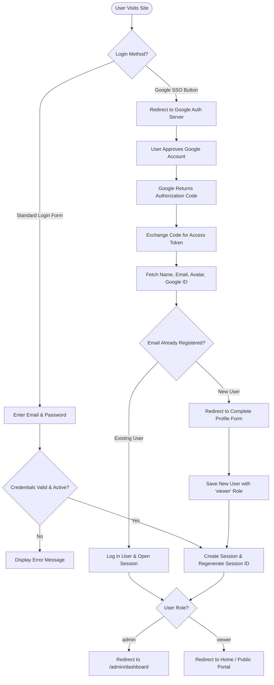

# Authentication & Authorization Documentation - BLUD SMKN 2 Purwakarta

This document describes the user security architecture, authentication mechanisms, Google Single Sign-On (OAuth 2.0) integration, Role-Based Access Control (RBAC), and middleware protection implemented in the **BLUD SMKN 2 Purwakarta** system.

---

## 1. User Security Architecture

The system implements a **Hybrid Authentication** scheme:
1. **Traditional Authentication**: Based on local email and password credentials hashed with *Bcrypt*.
2. **Google OAuth 2.0 Single Sign-On (SSO)**: Allows quick login and registration using Google accounts (particularly school institutional email or personal Google accounts).



---

## 2. Google OAuth 2.0 (SSO) Integration Flow

Google SSO is managed modularly by `App\Http\Controllers\GoogleAuthController`:

### Step 1: Client Redirection (`redirect()`)
When a user clicks the *"Sign in with Google"* button, the controller constructs the official Google authorization URL:
```php
$query = http_build_query([
    'client_id' => env('GOOGLE_CLIENT_ID'),
    'redirect_uri' => env('GOOGLE_REDIRECT_URI'),
    'response_type' => 'code',
    'scope' => 'openid email profile',
]);
return redirect('https://accounts.google.com/o/oauth2/v2/auth?' . $query);
```

### Step 2: Callback Reception & Token Exchange (`callback()`)
Google redirects back with an authorization `code` to `http://localhost:8000/auth/google/callback`. The controller makes an HTTP POST request to exchange the code for tokens:
- **Token Endpoint**: `https://oauth2.googleapis.com/token`
- **Userinfo Endpoint**: `https://www.googleapis.com/oauth2/v2/userinfo`

### Step 3: Profile Handling & New User Registration
1. **Existing User**: If the email returned from Google already exists in the `users` table, the user is authenticated immediately (`Auth::login($existingUser)`).
2. **New User**: If the email does not exist in the database:
   - Temporary attributes (`name`, `email`, `avatar`, `google_id`) are stored in the session (`Session::put('google_user', ...)`).
   - The user is redirected to the profile completion form to provide a valid phone number (`/google/complete-profile`).
   - Upon submitting a valid phone number, the new user record is saved with a secure random password hash (*24-character random hash*) and assigned the default role `viewer`.

---

## 3. Traditional (Local) Authentication Flow

Standard credential management is handled by `App\Http\Controllers\AuthController`:

### 3.1. Account Registration (`/register`)
- **Input Validation**:
  - `name`: Required, max 255 characters.
  - `email`: Required, valid email format, unique in `users` table.
  - `phone`: Required, valid Indonesian telephone format (`08...` or `+62...`).
  - `password`: Required, minimum 8 characters, must match `password_confirmation`.
- **Encryption**: Passwords are securely hashed using `Hash::make()` (Bcrypt).
- **Default Role**: New user accounts are automatically assigned the `viewer` role and `is_active = true`.

### 3.2. User Login (`/login`)
- **Credential Verification**: `Auth::attempt(['email' => $email, 'password' => $password], $remember)`.
- **Active Account Check**: If `is_active === false`, login is rejected and an error alert is displayed stating that the account has been deactivated by an administrator.
- **Session Fixation Prevention**: Calls `$request->session()->regenerate()` upon successful authentication to guard against session hijacking attacks.

### 3.3. User Logout (`/logout`)
- Executes `Auth::logout()`.
- Flushes the active session with `$request->session()->invalidate()`.
- Regenerates the CSRF token with `$request->session()->regenerateToken()` for subsequent requests.

---

## 4. Role-Based Access Control (RBAC)

The system enforces two distinct authorization levels (*Roles*):

| Role | Public Portal Access | Admin Dashboard Access | Permissions & Capabilities |
|---|:---:|:---:|---|
| **`admin`** | Yes | Yes (`/admin/*`) | Full access: Manage institutional profile, CRUD for services, facilities, news, organigram structure, user management, role assignments, and activity audit logs. |
| **`viewer`** | Yes | Denied (403 Forbidden) | Read public information, browse news articles, view service and facility catalogs, and submit contact inquiry messages. |

---

## 5. Middleware & Security Protection

### 5.1. `AdminMiddleware` (`app/Http/Middleware/AdminMiddleware.php`)
Applied to the `/admin/*` route group. Validates two security layers:
1. **Authentication**: `Auth::check()` — Ensures the user is authenticated. Unauthenticated visitors are redirected to `/login`.
2. **Authorization**: `Auth::user()->isAdmin()` — Checks if the user's `role === 'admin'`. Non-admin accounts receive an immediate `403 Forbidden` response.

```php
public function handle(Request $request, Closure $next)
{
    if (!Auth::check()) {
        return redirect()->route('login');
    }

    if (!Auth::user()->isAdmin()) {
        abort(403, 'You do not have access to the administration area.');
    }

    return $next($request);
}
```

### 5.2. Admin Self-Delete Prevention
In `UserController::destroy()`, the system prevents the currently logged-in administrator from deleting their own account:
```php
if ($user->id === Auth::id()) {
    return back()->with('error', 'You cannot delete your own account.');
}
```

### 5.3. CSRF (Cross-Site Request Forgery) Protection
All state-mutating HTTP requests (`POST`, `PUT`, `PATCH`, `DELETE`) are protected by Laravel's CSRF token system via the `@csrf` Blade directive in HTML forms and the `X-CSRF-TOKEN` header in AJAX/Fetch API requests.
