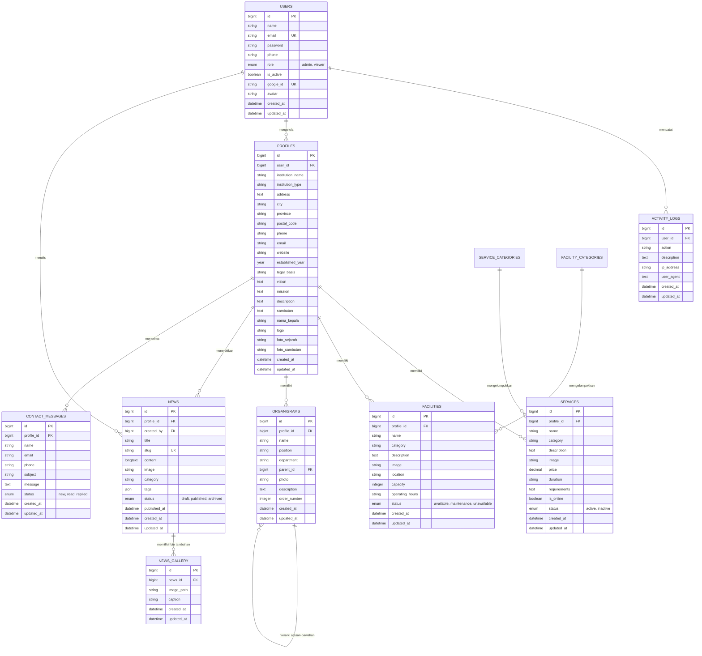

# 🗄️ Dokumentasi Basis Data (Database) - BLUD SMKN 2 Purwakarta

Dokumen ini menjelaskan struktur arsitektur basis data, Entity Relationship Diagram (ERD), skema tabel lengkap, Model Eloquent, relasi antar entitas, serta pengelolaan migrasi dan data seeder pada sistem informasi **BLUD SMKN 2 Purwakarta**.

---

## 🏗️ 1. Diagram Hubungan Entitas (ERD)



---

## 📋 2. Skema Tabel Terinci

### 2.1. Tabel `users`
Menyimpan data akun pengguna baik administrator maupun pengunjung/viewer, termasuk data autentikasi Google SSO.

| Kolom | Tipe Data | Keterangan | Atribut / Index |
|---|---|---|---|
| `id` | BIGINT UNSIGNED | Primary Key | Auto Increment, PK |
| `name` | VARCHAR(255) | Nama lengkap pengguna | NOT NULL |
| `email` | VARCHAR(255) | Alamat email unik | NOT NULL, UNIQUE |
| `password` | VARCHAR(255) | Hash password (bcrypt) | NOT NULL |
| `phone` | VARCHAR(20) | Nomor telepon/WhatsApp aktif | NOT NULL |
| `role` | ENUM('admin', 'viewer') | Hak akses sistem | DEFAULT 'viewer' |
| `is_active` | BOOLEAN | Status aktif akun | DEFAULT TRUE |
| `google_id` | VARCHAR(255) | ID identitas dari Google OAuth | NULLABLE, UNIQUE |
| `avatar` | VARCHAR(255) | URL/path foto profil | NULLABLE |
| `remember_token` | VARCHAR(100) | Token sesi login otomatis | NULLABLE |
| `created_at` | TIMESTAMP | Waktu pembuatan akun | NULLABLE |
| `updated_at` | TIMESTAMP | Waktu pembaruan terakhir | NULLABLE |

---

### 2.2. Tabel `profiles`
Menyimpan data identitas kelembagaan BLUD SMKN 2 Purwakarta, visi-misi, sejarah, sambutan pimpinan, dan kontak resmi.

| Kolom | Tipe Data | Keterangan | Atribut / Index |
|---|---|---|---|
| `id` | BIGINT UNSIGNED | Primary Key | Auto Increment, PK |
| `user_id` | BIGINT UNSIGNED | Relasi ke admin pembuat | FK -> users.id |
| `institution_name` | VARCHAR(255) | Nama instansi (SMKN 2 Purwakarta) | NOT NULL |
| `institution_type` | VARCHAR(100) | Jenis instansi (SMK Negeri / BLUD) | NOT NULL |
| `address` | TEXT | Alamat lengkap sekolah | NOT NULL |
| `city` | VARCHAR(100) | Kota/Kabupaten (Purwakarta) | NOT NULL |
| `province` | VARCHAR(100) | Provinsi (Jawa Barat) | NOT NULL |
| `postal_code` | VARCHAR(10) | Kode pos | NOT NULL |
| `phone` | VARCHAR(20) | Nomor telepon kantor | NOT NULL |
| `email` | VARCHAR(255) | Email korespondensi resmi | NOT NULL |
| `website` | VARCHAR(255) | Alamat website resmi | NOT NULL |
| `established_year` | YEAR | Tahun pendirian | NOT NULL |
| `legal_basis` | VARCHAR(255) | Dasar hukum penetapan BLUD | NOT NULL |
| `vision` | TEXT | Visi BLUD SMKN 2 Purwakarta | NOT NULL |
| `mission` | TEXT | Misi BLUD SMKN 2 Purwakarta | NOT NULL |
| `description` | TEXT | Gambaran umum / sejarah BLUD | NOT NULL |
| `sambutan` | TEXT | Teks sambutan Kepala Sekolah | NULLABLE |
| `nama_kepala` | VARCHAR(255) | Nama Kepala Sekolah beserta gelar | NULLABLE |
| `logo` | VARCHAR(255) | Path berkas logo institusi | NULLABLE |
| `foto_sejarah` | VARCHAR(255) | Path foto dokumentasi sejarah | NULLABLE |
| `foto_sambutan` | VARCHAR(255) | Path foto Kepala Sekolah | NULLABLE |
| `created_at` / `updated_at` | TIMESTAMP | Waktu audit sistem | NULLABLE |

---

### 2.3. Tabel `services` & `service_categories`
Menyimpan katalog produk dan jasa unggulan unit produksi BLUD.

**Tabel `services`:**
| Kolom | Tipe Data | Keterangan | Atribut |
|---|---|---|---|
| `id` | BIGINT UNSIGNED | Primary Key | Auto Increment, PK |
| `profile_id` | BIGINT UNSIGNED | Relasi ke profil instansi | FK -> profiles.id |
| `name` | VARCHAR(255) | Nama layanan / unit usaha | NOT NULL |
| `category` | VARCHAR(100) | Nama kategori layanan | NOT NULL |
| `description` | TEXT | Deskripsi lengkap layanan | NOT NULL |
| `image` | VARCHAR(255) | Path gambar brosur/foto | NULLABLE |
| `price` | DECIMAL(12,2) | Tarif layanan / estimasi harga | NULLABLE |
| `duration` | VARCHAR(100) | Estimasi waktu pengerjaan | NULLABLE |
| `requirements` | TEXT | Syarat pemesanan / berkas | NULLABLE |
| `is_online` | BOOLEAN | Apakah bisa dipesan daring | DEFAULT FALSE |
| `status` | ENUM('active', 'inactive') | Status ketersediaan layanan | DEFAULT 'active' |
| `created_at` / `updated_at` | TIMESTAMP | Audit log | NULLABLE |

**Tabel `service_categories`:**
| Kolom | Tipe Data | Keterangan |
|---|---|---|
| `id` | BIGINT UNSIGNED | Primary Key |
| `name` | VARCHAR(255) | Nama kategori |
| `slug` | VARCHAR(255) | Slug unik |
| `description` | TEXT | Deskripsi kategori |

---

### 2.4. Tabel `facilities` & `facility_categories`
Menyimpan data sarana, prasarana, bengkel kerja, lab komputer, dan ruang sewa.

**Tabel `facilities`:**
| Kolom | Tipe Data | Keterangan | Atribut |
|---|---|---|---|
| `id` | BIGINT UNSIGNED | Primary Key | Auto Increment, PK |
| `profile_id` | BIGINT UNSIGNED | Relasi ke profil instansi | FK -> profiles.id |
| `name` | VARCHAR(255) | Nama fasilitas / laboratorium | NOT NULL |
| `category` | VARCHAR(100) | Kategori sarana | NOT NULL |
| `description` | TEXT | Penjelasan fasilitas & alat | NOT NULL |
| `image` | VARCHAR(255) | Foto sarana / ruangan | NULLABLE |
| `location` | VARCHAR(255) | Posisi gedung/ruangan | NOT NULL |
| `capacity` | INTEGER | Kapasitas pengguna/orang | NOT NULL |
| `operating_hours`| VARCHAR(100) | Jam operasional | NOT NULL |
| `status` | ENUM('available', 'maintenance', 'unavailable') | Status kondisi fasilitas | DEFAULT 'available' |
| `created_at` / `updated_at` | TIMESTAMP | Audit log | NULLABLE |

---

### 2.5. Tabel `news` & `gallery` (NewsGallery)
Menyimpan artikel warta berita, liputan kegiatan, dan dokumentasi foto.

**Tabel `news`:**
| Kolom | Tipe Data | Keterangan | Atribut |
|---|---|---|---|
| `id` | BIGINT UNSIGNED | Primary Key | Auto Increment, PK |
| `profile_id` | BIGINT UNSIGNED | Relasi profil instansi | FK -> profiles.id |
| `created_by` | BIGINT UNSIGNED | ID penulis berita | FK -> users.id |
| `title` | VARCHAR(255) | Judul warta | NOT NULL |
| `slug` | VARCHAR(255) | URL-friendly slug unik | NOT NULL, UNIQUE |
| `content` | LONGTEXT | Isi artikel lengkap | NOT NULL |
| `image` | VARCHAR(255) | Foto sampul utama | NULLABLE |
| `category` | VARCHAR(100) | Kategori berita | NOT NULL |
| `tags` | JSON | Label / tags warta | NULLABLE |
| `status` | ENUM('draft', 'published', 'archived') | Status publikasi | DEFAULT 'draft' |
| `published_at` | DATETIME | Waktu rilis tayang | NULLABLE |
| `created_at` / `updated_at` | TIMESTAMP | Audit log | NULLABLE |

**Tabel `gallery` (NewsGallery):**
| Kolom | Tipe Data | Keterangan |
|---|---|---|
| `id` | BIGINT UNSIGNED | Primary Key |
| `news_id` | BIGINT UNSIGNED | Relasi ke warta berita (FK) |
| `image_path` | VARCHAR(255) | Berkas gambar tambahan |
| `caption` | VARCHAR(255) | Keterangan foto |

---

### 2.6. Tabel `organigrams`
Menyimpan data struktur organisasi pengelola BLUD dalam format hierarki pohon (*tree structure*).

| Kolom | Tipe Data | Keterangan | Atribut |
|---|---|---|---|
| `id` | BIGINT UNSIGNED | Primary Key | Auto Increment, PK |
| `profile_id` | BIGINT UNSIGNED | Relasi profil instansi | FK -> profiles.id |
| `name` | VARCHAR(255) | Nama pejabat / pengurus | NOT NULL |
| `position` | VARCHAR(255) | Jabatan / posisi struktural | NOT NULL |
| `department` | VARCHAR(255) | Divisi / unit kerja | NOT NULL |
| `parent_id` | BIGINT UNSIGNED | Relasi ke atasan langsung | Self-referencing FK -> organigrams.id (NULL = Pucuk) |
| `photo` | VARCHAR(255) | Foto resmi pengurus | NULLABLE |
| `description` | TEXT | Tugas pokok dan fungsi | NULLABLE |
| `order_number` | INTEGER | Urutan tampilan / level | DEFAULT 0 |
| `created_at` / `updated_at` | TIMESTAMP | Audit log | NULLABLE |

---

### 2.7. Tabel `contact_messages`
Menyimpan formulir pesan, pertanyaan, dan permohonan kerjasama dari masyarakat/industri.

| Kolom | Tipe Data | Keterangan | Atribut |
|---|---|---|---|
| `id` | BIGINT UNSIGNED | Primary Key | Auto Increment, PK |
| `profile_id` | BIGINT UNSIGNED | Relasi profil instansi | FK -> profiles.id |
| `name` | VARCHAR(255) | Nama pengirim | NOT NULL |
| `email` | VARCHAR(255) | Email pengirim | NOT NULL |
| `phone` | VARCHAR(20) | Nomor kontak pengirim | NOT NULL |
| `subject` | VARCHAR(255) | Perihal / subjek pesan | NOT NULL |
| `message` | TEXT | Isi pesan pertanyaan/proposal | NOT NULL |
| `status` | ENUM('new', 'read', 'replied') | Status penanganan pesan | DEFAULT 'new' |
| `created_at` / `updated_at` | TIMESTAMP | Audit log | NULLABLE |

---

### 2.8. Tabel `activity_logs`
Menyimpan jejak audit (*audit trail*) setiap aktivitas krusial yang dilakukan admin/user pada sistem.

| Kolom | Tipe Data | Keterangan | Atribut |
|---|---|---|---|
| `id` | BIGINT UNSIGNED | Primary Key | Auto Increment, PK |
| `user_id` | BIGINT UNSIGNED | Pengguna pelaku aktivitas | FK -> users.id |
| `action` | VARCHAR(255) | Jenis aksi (misal: CREATE_NEWS, LOGIN) | NOT NULL |
| `description` | TEXT | Rincian aktivitas | NOT NULL |
| `ip_address` | VARCHAR(45) | Alamat IP klien (IPv4/IPv6) | NULLABLE |
| `user_agent` | TEXT | Informasi browser/perangkat | NULLABLE |
| `created_at` / `updated_at` | TIMESTAMP | Waktu terjadinya aksi | NULLABLE |

---

### 2.9. Tabel Pendukung Framework Laravel
- **`sessions`**: Manajemen session penyimpanan berbasis database.
- **`cache` & `cache_locks`**: Penyimpanan cache performa tinggi.
- **`jobs`**, **`job_batches`**, **`failed_jobs`**: Antrian proses asynchronous background (*queue system*).

---

## 💻 3. Model Eloquent & Relasi Data

Seluruh model berada di direktori `app/Models/`:

| Nama Model | Berkas Model | Relasi Utama |
|---|---|---|
| **`User`** | `app/Models/User.php` | `hasMany(ActivityLog)`, `hasMany(News, 'created_by')`, `hasOne(Profile)` |
| **`Profile`** | `app/Models/Profile.php` | `belongsTo(User)`, `hasMany(Service)`, `hasMany(Facility)`, `hasMany(Organigram)`, `hasMany(News)`, `hasMany(ContactMessage)` |
| **`Service`** | `app/Models/Service.php` | `belongsTo(Profile)`, `belongsTo(ServiceCategory)` |
| **`ServiceCategory`** | `app/Models/ServiceCategory.php` | `hasMany(Service)` |
| **`Facility`** | `app/Models/Facility.php` | `belongsTo(Profile)`, `belongsTo(FacilityCategory)` |
| **`FacilityCategory`** | `app/Models/FacilityCategory.php` | `hasMany(Facility)` |
| **`News`** | `app/Models/News.php` | `belongsTo(Profile)`, `belongsTo(User, 'created_by')`, `hasMany(NewsGallery)`, *Sluggable Trait* |
| **`NewsGallery`** | `app/Models/NewsGallery.php` | `belongsTo(News)` |
| **`Organigram`** | `app/Models/Organigram.php` | `belongsTo(Profile)`, `belongsTo(Organigram, 'parent_id')` (Parent), `hasMany(Organigram, 'parent_id')` (Children) |
| **`ContactMessage`** | `app/Models/ContactMessage.php` | `belongsTo(Profile)` |
| **`ActivityLog`** | `app/Models/ActivityLog.php` | `belongsTo(User)` |

---

## 🚀 4. Data Seeder & Inisialisasi

Untuk mengisi data awal instansi SMKN 2 Purwakarta, seeder yang tersedia di folder `database/seeders/` mencakup:

1. **`AdminUserSeeder`**:
   - Akun Super Admin: `admin@smkn2purwakarta.sch.id` (Password: `password`, Role: `admin`)
   - Akun Pengunjung Demo: `viewer@smkn2purwakarta.sch.id` (Password: `password`, Role: `viewer`)
2. **`InitialDataSeeder` / `HomeSectionSeeder`**:
   - Data profil resmi BLUD SMKN 2 Purwakarta (Visi, Misi, Alamat, SK Legalitas).
   - Kategori & data awal layanan unit produksi (Teaching Factory).
   - Kategori & data fasilitas laboratorium / bengkel kerja.
   - Struktur bagan organisasi kepemimpinan BLUD.
   - Contoh artikel berita awal dan kegiatan sekolah.

### Cara Menjalankan Migrasi & Seeder:
```bash
# Menjalankan seluruh migrasi dari awal beserta data bawaan
php artisan migrate:fresh --seed
```
