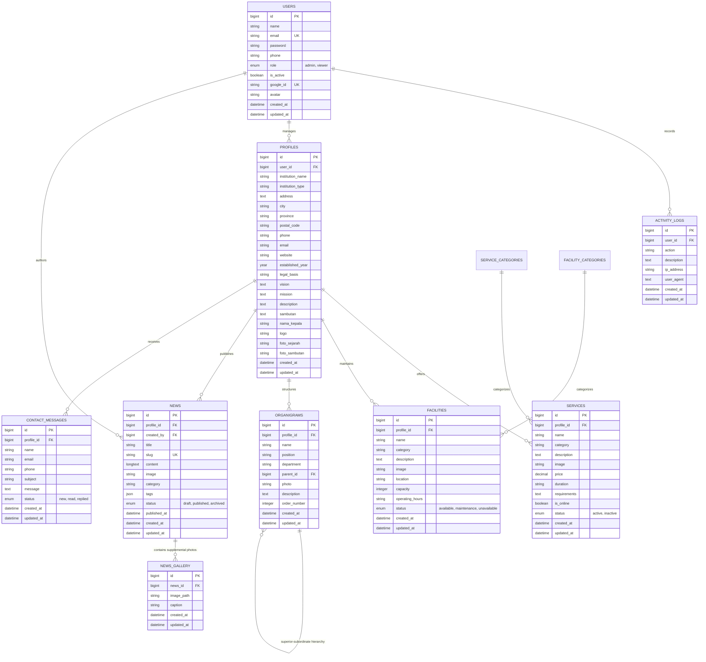

# Database Documentation - BLUD SMKN 2 Purwakarta

This document describes the database architecture, Entity Relationship Diagram (ERD), full table schemas, Eloquent Models, data relationships, and migration/seeding procedures for the **BLUD SMKN 2 Purwakarta** system.

---

## 1. Entity Relationship Diagram (ERD)



---

## 2. Detailed Table Schemas

### 2.1. `users` Table
Stores user accounts for both administrators and general viewers, including Google SSO authentication data.

| Column | Data Type | Description | Attributes / Index |
|---|---|---|---|
| `id` | BIGINT UNSIGNED | Primary Key | Auto Increment, PK |
| `name` | VARCHAR(255) | Full name | NOT NULL |
| `email` | VARCHAR(255) | Unique email address | NOT NULL, UNIQUE |
| `password` | VARCHAR(255) | Hashed password (bcrypt) | NOT NULL |
| `phone` | VARCHAR(20) | Active phone/WhatsApp number | NOT NULL |
| `role` | ENUM('admin', 'viewer') | System access role | DEFAULT 'viewer' |
| `is_active` | BOOLEAN | Account active status | DEFAULT TRUE |
| `google_id` | VARCHAR(255) | Google OAuth identity ID | NULLABLE, UNIQUE |
| `avatar` | VARCHAR(255) | Profile image URL/path | NULLABLE |
| `remember_token` | VARCHAR(100) | Remember-me session token | NULLABLE |
| `created_at` | TIMESTAMP | Creation timestamp | NULLABLE |
| `updated_at` | TIMESTAMP | Last update timestamp | NULLABLE |

---

### 2.2. `profiles` Table
Stores institutional information for BLUD SMKN 2 Purwakarta, including vision, mission, history, principal's greeting, and official contacts.

| Column | Data Type | Description | Attributes / Index |
|---|---|---|---|
| `id` | BIGINT UNSIGNED | Primary Key | Auto Increment, PK |
| `user_id` | BIGINT UNSIGNED | Relation to authoring admin | FK -> users.id |
| `institution_name` | VARCHAR(255) | Institution name (SMKN 2 Purwakarta) | NOT NULL |
| `institution_type` | VARCHAR(100) | Institution type (SMK Negeri / BLUD) | NOT NULL |
| `address` | TEXT | Campus address | NOT NULL |
| `city` | VARCHAR(100) | City/Regency (Purwakarta) | NOT NULL |
| `province` | VARCHAR(100) | Province (Jawa Barat) | NOT NULL |
| `postal_code` | VARCHAR(10) | Postal code | NOT NULL |
| `phone` | VARCHAR(20) | Office phone number | NOT NULL |
| `email` | VARCHAR(255) | Official correspondence email | NOT NULL |
| `website` | VARCHAR(255) | Official website URL | NOT NULL |
| `established_year` | YEAR | Founding year | NOT NULL |
| `legal_basis` | VARCHAR(255) | Legal decree basis of BLUD | NOT NULL |
| `vision` | TEXT | BLUD vision statement | NOT NULL |
| `mission` | TEXT | BLUD mission statements | NOT NULL |
| `description` | TEXT | General description / history | NOT NULL |
| `sambutan` | TEXT | Principal's welcoming speech | NULLABLE |
| `nama_kepala` | VARCHAR(255) | Principal's full name & title | NULLABLE |
| `logo` | VARCHAR(255) | Institutional logo file path | NULLABLE |
| `foto_sejarah` | VARCHAR(255) | Historical photo file path | NULLABLE |
| `foto_sambutan` | VARCHAR(255) | Principal's portrait file path | NULLABLE |
| `created_at` / `updated_at` | TIMESTAMP | System audit timestamps | NULLABLE |

---

### 2.3. `services` & `service_categories` Tables
Stores the catalog of vocational products and services offered by the BLUD production units.

**`services` Table:**
| Column | Data Type | Description | Attributes |
|---|---|---|---|
| `id` | BIGINT UNSIGNED | Primary Key | Auto Increment, PK |
| `profile_id` | BIGINT UNSIGNED | Relation to institutional profile | FK -> profiles.id |
| `name` | VARCHAR(255) | Service or product name | NOT NULL |
| `category` | VARCHAR(100) | Category name | NOT NULL |
| `description` | TEXT | Detailed service description | NOT NULL |
| `image` | VARCHAR(255) | Brochure/photo file path | NULLABLE |
| `price` | DECIMAL(12,2) | Rate or price estimate | NULLABLE |
| `duration` | VARCHAR(100) | Estimated completion duration | NULLABLE |
| `requirements` | TEXT | Booking/order prerequisites | NULLABLE |
| `is_online` | BOOLEAN | Available for online ordering | DEFAULT FALSE |
| `status` | ENUM('active', 'inactive') | Service availability status | DEFAULT 'active' |
| `created_at` / `updated_at` | TIMESTAMP | Audit timestamps | NULLABLE |

**`service_categories` Table:**
| Column | Data Type | Description |
|---|---|---|
| `id` | BIGINT UNSIGNED | Primary Key |
| `name` | VARCHAR(255) | Category name |
| `slug` | VARCHAR(255) | Unique slug |
| `description` | TEXT | Category description |

---

### 2.4. `facilities` & `facility_categories` Tables
Stores infrastructure data, workshops, computer labs, and rentable spaces.

**`facilities` Table:**
| Column | Data Type | Description | Attributes |
|---|---|---|---|
| `id` | BIGINT UNSIGNED | Primary Key | Auto Increment, PK |
| `profile_id` | BIGINT UNSIGNED | Relation to institutional profile | FK -> profiles.id |
| `name` | VARCHAR(255) | Facility / laboratory name | NOT NULL |
| `category` | VARCHAR(100) | Facility category | NOT NULL |
| `description` | TEXT | Description & equipment specifications | NOT NULL |
| `image` | VARCHAR(255) | Photo file path | NULLABLE |
| `location` | VARCHAR(255) | Building/room location | NOT NULL |
| `capacity` | INTEGER | User/seating capacity | NOT NULL |
| `operating_hours`| VARCHAR(100) | Operating hours | NOT NULL |
| `status` | ENUM('available', 'maintenance', 'unavailable') | Facility status | DEFAULT 'available' |
| `created_at` / `updated_at` | TIMESTAMP | Audit timestamps | NULLABLE |

---

### 2.5. `news` & `gallery` (NewsGallery) Tables
Stores articles, news publications, activity coverage, and supplemental media.

**`news` Table:**
| Column | Data Type | Description | Attributes |
|---|---|---|---|
| `id` | BIGINT UNSIGNED | Primary Key | Auto Increment, PK |
| `profile_id` | BIGINT UNSIGNED | Relation to profile | FK -> profiles.id |
| `created_by` | BIGINT UNSIGNED | Author user ID | FK -> users.id |
| `title` | VARCHAR(255) | Article headline | NOT NULL |
| `slug` | VARCHAR(255) | Unique URL slug | NOT NULL, UNIQUE |
| `content` | LONGTEXT | Full article body content | NOT NULL |
| `image` | VARCHAR(255) | Header/cover image path | NULLABLE |
| `category` | VARCHAR(100) | Article category | NOT NULL |
| `tags` | JSON | Topical tags array | NULLABLE |
| `status` | ENUM('draft', 'published', 'archived') | Publication status | DEFAULT 'draft' |
| `published_at` | DATETIME | Publication timestamp | NULLABLE |
| `created_at` / `updated_at` | TIMESTAMP | Audit timestamps | NULLABLE |

**`gallery` Table (NewsGallery):**
| Column | Data Type | Description |
|---|---|---|
| `id` | BIGINT UNSIGNED | Primary Key |
| `news_id` | BIGINT UNSIGNED | Relation to news article (FK) |
| `image_path` | VARCHAR(255) | Image file path |
| `caption` | VARCHAR(255) | Photo caption |

---

### 2.6. `organigrams` Table
Stores the administrative and organizational hierarchy in a tree structure.

| Column | Data Type | Description | Attributes |
|---|---|---|---|
| `id` | BIGINT UNSIGNED | Primary Key | Auto Increment, PK |
| `profile_id` | BIGINT UNSIGNED | Relation to profile | FK -> profiles.id |
| `name` | VARCHAR(255) | Official's name | NOT NULL |
| `position` | VARCHAR(255) | Position / title | NOT NULL |
| `department` | VARCHAR(255) | Division / department | NOT NULL |
| `parent_id` | BIGINT UNSIGNED | Direct supervisor relation | Self-referencing FK -> organigrams.id (NULL = Root) |
| `photo` | VARCHAR(255) | Portrait photo file path | NULLABLE |
| `description` | TEXT | Responsibilities & job description | NULLABLE |
| `order_number` | INTEGER | Display sequence / priority | DEFAULT 0 |
| `created_at` / `updated_at` | TIMESTAMP | Audit timestamps | NULLABLE |

---

### 2.7. `contact_messages` Table
Stores contact form submissions, inquiries, and business proposals from visitors.

| Column | Data Type | Description | Attributes |
|---|---|---|---|
| `id` | BIGINT UNSIGNED | Primary Key | Auto Increment, PK |
| `profile_id` | BIGINT UNSIGNED | Relation to profile | FK -> profiles.id |
| `name` | VARCHAR(255) | Sender's full name | NOT NULL |
| `email` | VARCHAR(255) | Sender's email address | NOT NULL |
| `phone` | VARCHAR(20) | Sender's contact number | NOT NULL |
| `subject` | VARCHAR(255) | Message subject | NOT NULL |
| `message` | TEXT | Message body text | NOT NULL |
| `status` | ENUM('new', 'read', 'replied') | Handling status | DEFAULT 'new' |
| `created_at` / `updated_at` | TIMESTAMP | Audit timestamps | NULLABLE |

---

### 2.8. `activity_logs` Table
Maintains an audit trail of critical administrator and user actions across the system.

| Column | Data Type | Description | Attributes |
|---|---|---|---|
| `id` | BIGINT UNSIGNED | Primary Key | Auto Increment, PK |
| `user_id` | BIGINT UNSIGNED | User performing action | FK -> users.id |
| `action` | VARCHAR(255) | Action key (e.g., CREATE_NEWS, LOGIN) | NOT NULL |
| `description` | TEXT | Activity description | NOT NULL |
| `ip_address` | VARCHAR(45) | Client IP address (IPv4/IPv6) | NULLABLE |
| `user_agent` | TEXT | Browser / device information | NULLABLE |
| `created_at` / `updated_at` | TIMESTAMP | Action timestamp | NULLABLE |

---

### 2.9. Framework Supporting Tables
- **`sessions`**: Database-backed user session storage.
- **`cache` & `cache_locks`**: High-performance caching storage.
- **`jobs`**, **`job_batches`**, **`failed_jobs`**: Asynchronous background queue processing.

---

## 3. Eloquent Models & Data Relationships

All models reside in `app/Models/`:

| Model Name | Model File | Key Relationships |
|---|---|---|
| **`User`** | `app/Models/User.php` | `hasMany(ActivityLog)`, `hasMany(News, 'created_by')`, `hasOne(Profile)` |
| **`Profile`** | `app/Models/Profile.php` | `belongsTo(User)`, `hasMany(Service)`, `hasMany(Facility)`, `hasMany(Organigram)`, `hasMany(News)`, `hasMany(ContactMessage)` |
| **`Service`** | `app/Models/Service.php` | `belongsTo(Profile)`, `belongsTo(ServiceCategory)` |
| **`ServiceCategory`** | `app/Models/ServiceCategory.php` | `hasMany(Service)` |
| **`Facility`** | `app/Models/Facility.php` | `belongsTo(Profile)`, `belongsTo(FacilityCategory)` |
| **`FacilityCategory`** | `app/Models/FacilityCategory.php` | `hasMany(Facility)` |
| **`News`** | `app/Models/News.php` | `belongsTo(Profile)`, `belongsTo(User, 'created_by')`, `hasMany(NewsGallery)`, *Sluggable Trait* |
| **`NewsGallery`** | `app/Models/NewsGallery.php` | `belongsTo(News)` |
| **`Organigram`** | `app/Models/Organigram.php` | `belongsTo(Profile)`, `belongsTo(Organigram, 'parent_id')` (Parent), `hasMany(Organigram, 'parent_id')` (Children) |
| **`ContactMessage`** | `app/Models/ContactMessage.php` | `belongsTo(Profile)` |
| **`ActivityLog`** | `app/Models/ActivityLog.php` | `belongsTo(User)` |

---

## 4. Seeders & Data Initialization

Seeders in `database/seeders/` include:

1. **`AdminUserSeeder`**:
   - Super Admin account: `admin@smkn2purwakarta.sch.id` (Password: `password`, Role: `admin`)
   - Demo Visitor account: `viewer@smkn2purwakarta.sch.id` (Password: `password`, Role: `viewer`)
2. **`InitialDataSeeder` / `HomeSectionSeeder`**:
   - Official BLUD SMKN 2 Purwakarta profile data (Vision, Mission, Address, Legal Decree).
   - Initial categories & vocational service offerings (Teaching Factory).
   - Facility and laboratory categories and items.
   - BLUD leadership organizational chart structure.
   - Initial news articles and activity updates.

### Running Migrations & Seeders:
```bash
# Run all migrations from scratch and seed initial data
php artisan migrate:fresh --seed
```
