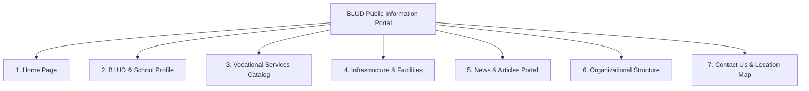
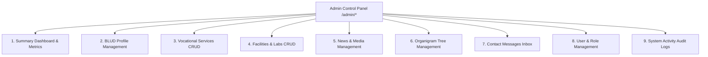

# Features & Modules Documentation - BLUD SMKN 2 Purwakarta

This document provides a comprehensive overview of all functional features and modules available in the **BLUD SMKN 2 Purwakarta** system, spanning both the **Public Portal (Frontend)** and the **Administration Panel (Backend Admin)**.

---

## 1. Public Information Portal Modules

The public portal is designed with a modern, responsive, and visually rich aesthetic to present transparent information about the BLUD to the general public, students, parents, and industrial partners (IDUKA).

### 1.1. Home Page (`/`)
- **Interactive Hero Banner**: Features the core identity of BLUD SMKN 2 Purwakarta with modern typography, excellence badges, and quick *Call-to-Action (CTA)* buttons linking directly to the services catalog and contact page.
- **Achievement Counters (Dynamic Badges)**: Displays statistics for vocational units, specialized laboratories, published news, and industrial partnerships.
- **Featured Products & Services Showcase**: Highlights premier *Teaching Factory (TeFa)* products from various vocational departments.
- **Selected Facilities Preview**: Showcases modern workshops and computer labs with live availability status indicators.
- **Latest News & Updates**: Displays recent articles, announcements, and school activity coverage.
- **Scroll Animations**: Powered by the *AOS (Animate On Scroll)* library for smooth, subtle reveal animations as the visitor scrolls.

---

### 1.2. BLUD & School Profile Page (`/profil`)
- **Principal's Welcome Address**: Official leadership portrait and welcoming speech from the School Principal.
- **History & Background**: Narrative of SMKN 2 Purwakarta's evolution into a Regional Public Service Agency (BLUD).
- **Legal Framework & Decrees**: Official decree numbers and legal accreditation establishing the BLUD.
- **Institutional Vision & Mission**: Strategic vision, goals, and mission statements for vocational education delivery.
- **Official Identity Details**: Campus address, official contact details, administrative email, and related institutional links.

---

### 1.3. Vocational Services & Products Catalog (`/layanan` & `/layanan/{service}`)
- **Category Filtering**: Fast filtering by vocational discipline or service division.
- **Interactive Service Cards**: Product/service photography, estimated pricing (IDR), completion turnaround time, and active status indicators.
- **Service Detail Page (`/layanan/{id}`)**:
  - Detailed product/service technical specifications.
  - Required documents and ordering terms.
  - Direct inquiry action buttons via WhatsApp or online contact forms.

---

### 1.4. Infrastructure & Facilities (`/fasilitas`)
- **Workshops & Laboratories Gallery**: High-resolution photography of student practice facilities and rental spaces.
- **Real-Time Availability Badges**:
  - **Available**: The facility is open and ready for scheduling or rental.
  - **Maintenance**: Undergoing maintenance, repair, or tool calibration.
  - **Unavailable**: Fully booked or temporarily closed.
- **Facility Specifications**: Building location, seating/participant capacity, and daily operating hours.

---

### 1.5. News & School Activities (`/berita` & `/berita/{slug}`)
- **Article Catalog**: Official news publications arranged in a modern grid layout.
- **Search & Filter**: Keyword search on article titles and category-based filtering.
- **Article Reader Page (`/berita/{slug}`)**:
  - SEO-friendly URLs using unique slugs (`cviebrock/eloquent-sluggable`).
  - Metadata including author, publication date, category, and topical tags.
  - Rich-text formatted body (paragraphs, quotes, lists).
  - Supplemental activity photo gallery.
  - Related news suggestions in the sidebar.

---

### 1.6. Organizational Structure (`/organigram`)
- **Hierarchical Tree Visualization**: Visual display of the BLUD administrative hierarchy from leadership (Principal/Director) down to department coordinators and staff.
- **Personnel Cards**: Formal portrait, full name with academic titles, structural role, department, and summary of primary responsibilities.

---

### 1.7. Contact Us & Location Map (`/kontak`)
- **Direct Message Submission Form**: Public inquiry and partnership request form delivered straight to the *Admin Inbox*.
- **Comprehensive Contact Details**: Campus address, telephone numbers, official WhatsApp helpdesk, and institutional email.
- **Integrated Google Maps**: Interactive map of SMKN 2 Purwakarta for easy navigation and campus visits.

---

## 2. Administration Panel (Admin Dashboard)

A secure management control center guarded by `AdminMiddleware` on `/admin/*` routes.

### 2.1. Main Dashboard (`/admin/dashboard`)
- **Summary Statistical Cards**:
  - Total Active Services.
  - Total Facilities.
  - Total Published News Articles.
  - Unread Contact Messages.
- **Real-Time Activity Feed**: Table of recent administrative actions for immediate operational visibility.

---

### 2.2. Institutional Profile Management (`/admin/profiles`)
- **BLUD Identity Editor**: Update institution name, official address, telephone, email, and website.
- **Legal Foundation & Vision/Mission**: Edit BLUD legal decrees, vision, and mission statements.
- **Profile Media Assets**: Upload school logos, historical archive photos, and the principal's official greeting portrait.

---

### 2.3. Vocational Services Management (`/admin/services`)
- **Full CRUD Functionality**: Create, edit, inspect details, and delete services.
- **Brochure & Photo Uploads**: Supports JPG, PNG, and WebP image formats.
- **Instant Status Toggle**: Fast switching between `active` and `inactive` states without page reloads (*AJAX PATCH*).

---

### 2.4. Facilities & Labs Management (`/admin/facilities`)
- **Full CRUD Functionality**: Create, edit, and delete workshops, labs, and spaces.
- **Operating Hours & Capacity**: Manage room dimensions, seating limits, and schedules.
- **AJAX Status Switcher**: Quick toggle between `available`, `maintenance`, and `unavailable`.

---

### 2.5. News & Media Management (`/admin/news`)
- **Article Publishing**: Create new posts with automatic slug generation from the title.
- **Publishing Status Workflow**:
  - `draft`: Work in progress / under review.
  - `published`: Publicly visible on the portal.
  - `archived`: Hidden from main listings but preserved in database.
- **One-Click Publishing Actions**: Fast action buttons to *Publish* (`/news/{id}/publish`) and *Archive* (`/news/{id}/archive`).
- **Photo Gallery Management**: Attach additional event documentation photos to any article.

---

### 2.6. Organizational Structure Management (`/admin/organigrams`)
- **Hierarchy Builder**: Assign direct supervisors (*parent*) to construct the organizational tree.
- **Order Numbering**: Adjust display hierarchy from top executive leadership to division staff.
- **Tree Structure API (`/admin/organigrams-tree`)**: Returns JSON tree data for dynamic organizational charts.

---

### 2.7. Contact Messages Inbox (`/admin/contact-messages`)
- **Inbound Message Feed**: Displays inquiries and cooperation proposals submitted by the public.
- **Status Tracking**:
  - `new`: Unread message.
  - `read`: Opened and reviewed by an administrator.
  - `replied`: Answered and resolved.
- **Quick Reply Shortcuts**: One-click actions to respond via email or WhatsApp.

---

### 2.8. User & Access Control Management (`/admin/users`)
- **Account Management**: Register new admin users, edit profile information, or remove accounts.
- **Instant Account Suspend/Activate**: Suspend or reactivate user login privileges via AJAX.
- **Dynamic Role Management**: Change user roles between `admin` and `viewer`.
- **Self-Delete Protection**: Guards active administrators against accidental deletion of their own accounts.

---

### 2.9. System Activity Audit Logs (`/admin/activity-logs`)
- **Automated Audit Trail**: Logs critical system actions (logins, article creation, service updates, facility changes, role adjustments).
- **Tracking Metadata**: Captures username, action type, description, client IP address, and User-Agent strings.
- **One-Click Log Purge (`/admin/activity-logs/clear`)**: Safely removes audit log entries older than 30 days to optimize database performance and storage.
