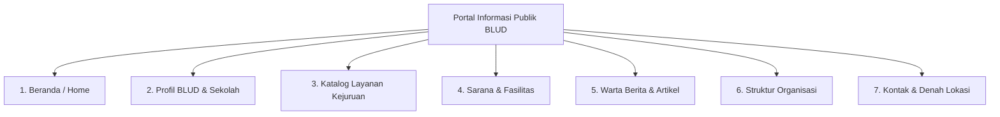
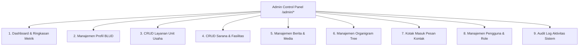

# 🌟 Dokumentasi Fitur & Modul - BLUD SMKN 2 Purwakarta

Dokumen ini menjelaskan secara menyeluruh seluruh fitur dan modul fungsional yang tersedia pada sistem informasi **BLUD SMKN 2 Purwakarta**, baik pada **Portal Publik (Frontend)** maupun **Panel Administrasi (Backend Admin)**.

---

## 🏛️ 1. Modul Portal Informasi Publik

Portal publik didesain secara modern, responsif, dan kaya estetika untuk menyajikan transparansi informasi BLUD kepada masyarakat, siswa, wali murid, dan mitra industri (IDUKA).

### 1.1. Halaman Beranda (`/`)
- **Hero Banner Interaktif**: Menampilkan identitas utama BLUD SMKN 2 Purwakarta dengan tipografi modern, badge keunggulan, dan tombol *Call-to-Action (CTA)* cepat menuju katalog layanan dan kontak.
- **Statistik Capaian (Counter Badges)**: Menampilkan angka jumlah unit layanan, sarana laboratorium, warta kegiatan, dan mitra industri secara dinamis.
- **Showcase Produk & Jasa Unggulan**: Cuplikan produk *Teaching Factory (TeFa)* terbaik dari berbagai program keahlian.
- **Fasilitas Pilihan**: Pratinjau bengkel dan laboratorium modern dengan indikator ketersediaan.
- **Warta Berita Terkini**: Artikel dan liputan kegiatan terbaru sekolah.
- **Animasi Modern**: Didukung oleh library *AOS (Animate On Scroll)* untuk efek *fade-up* halus pada setiap bagian.

---

### 1.2. Halaman Profil BLUD & Sekolah (`/profil`)
- **Sambutan Kepala Sekolah**: Menampilkan foto resmi dan pesan pengantar kepemimpinan.
- **Sejarah & Latar Belakang**: Uraian transformasi SMKN 2 Purwakarta menjadi Badan Layanan Umum Daerah (BLUD).
- **Dasar Hukum Penetapan**: Menampilkan nomor dan dasar Surat Keputusan (SK) legalitas BLUD.
- **Visi & Misi Kelembagaan**: Penyajian poin-poin visi masa depan dan misi strategis pelayanan pendidikan vokasi.
- **Identitas Lengkap**: Alamat kantor, kontak resmi, email dinas, dan tautan portal terkait.

---

### 1.3. Katalog Layanan Kejuruan / Unit Usaha (`/layanan` & `/layanan/{service}`)
- **Penyaringan Kategori**: Filter cepat berdasarkan divisi kejuruan atau bidang jasa.
- **Kartu Produk/Jasa Interaktif**: Dilengkapi foto produk, estimasi tarif (Rp), durasi pengerjaan, dan badge status aktif.
- **Halaman Detail Layanan (`/layanan/{id}`)**:
  - Deskripsi rinci spesifikasi pekerjaan atau spesifikasi barang.
  - Persyaratan berkas/dokumen pemesanan.
  - Opsi konsultasi langsung via WhatsApp / formulir online.

---

### 1.4. Sarana, Prasarana & Fasilitas (`/fasilitas`)
- **Galeri Bengkel & Laboratorium**: Menampilkan foto sarana praktik siswa dan ruangan sewa instansi.
- **Badge Status Kondisi Interaktif**:
  - 🟢 **Tersedia (*Available*)**: Fasilitas siap digunakan / disewa.
  - 🟡 **Dalam Perawatan (*Maintenance*)**: Sedang dalam tahap servis atau kalibrasi alat.
  - 🔴 **Tidak Tersedia (*Unavailable*)**: Sedang dipakai jadwal penuh.
- **Spesifikasi Sarana**: Lokasi gedung, kapasitas orang/peserta, dan jam operasional harian.

---

### 1.5. Warta Berita & Kegiatan Sekolah (`/berita` & `/berita/{slug}`)
- **Katalog Artikel**: Berita terbitan resmi dengan penataan grid modern.
- **Pencarian & Filter**: Pencarian artikel berdasarkan kata kunci judul dan pemilihan kategori warta.
- **Halaman Baca Warta (`/berita/{slug}`)**:
  - URL ramah SEO berbasis slug unik (`cviebrock/eloquent-sluggable`).
  - Metadata penulis, tanggal terbit, kategori, dan tag label.
  - Format isi artikel kaya teks (paragraf, kutipan, list).
  - Galeri dokumentasi foto kegiatan pendukung.
  - Rekomendasi warta berita terkait di bagian sidebar.

---

### 1.6. Bagan Struktur Organisasi (`/organigram`)
- **Visualisasi Hierarki Pohon**: Menampilkan susunan pengelola BLUD dari tingkat pimpinan puncak (Kepala Sekolah/BLUD), kepala unit produksi, bendahara, hingga ketua divisi.
- **Kartu Pejabat**: Dilengkapi foto formal, nama lengkap beserta gelar, posisi struktural, departemen, dan uraian tugas pokok.

---

### 1.7. Kontak Resmi & Denah Lokasi (`/kontak`)
- **Formulir Pengiriman Pesan Langsung**: Form pesan masyarakat yang otomatis masuk ke *Inbox Admin*.
- **Informasi Kontak Lengkap**: Alamat, nomor telepon kantor, no. WhatsApp layanan, dan email resmi.
- **Google Maps Terintegrasi**: Peta interaktif SMKN 2 Purwakarta memudahkan kunjungan langsung ke lokasi sekolah.

---

## ⚙️ 2. Modul Panel Administrasi (Admin Dashboard)

Panel kontrol khusus administrator yang diamankan dengan `AdminMiddleware` di route `/admin/*`.

### 2.1. Dashboard Utama (`/admin/dashboard`)
- **Kartu Statistik Ringkas**:
  - Total Layanan Aktif.
  - Total Sarana/Fasilitas.
  - Total Warta Berita Terbit.
  - Pesan Kontak Baru yang belum dibaca.
- **Log Aktivitas Terkini**: Tabel 5–10 aksi terakhir administrator untuk pemantauan sistem secara *real-time*.

---

### 2.2. Manajemen Profil Lembaga (`/admin/profiles`)
- **Editor Identitas BLUD**: Mengubah nama instansi, alamat lengkap, kontak, email, dan website.
- **Kelola Legalitas & Visi Misi**: Memperbarui dasar hukum SK BLUD, visi, dan misi.
- **Media Profil**: Upload berkas logo sekolah, foto sejarah, serta foto dan teks sambutan Kepala Sekolah.

---

### 2.3. Manajemen Layanan Unit Produksi (`/admin/services`)
- **Operasi CRUD Lengkap**: Tambah baru, edit data, lihat detail, dan hapus layanan.
- **Upload Brosur / Foto Produk**: Mendukung format gambar JPG, PNG, WebP.
- **Toggle Status Instan**: Mengubah status `active` / `inactive` secara cepat tanpa reload halaman (*AJAX PATCH*).

---

### 2.4. Manajemen Sarana & Fasilitas (`/admin/facilities`)
- **Operasi CRUD Lengkap**: Tambah, edit, dan hapus ruang bengkel / lab / sarana.
- **Pengaturan Jam & Kapasitas**: Konfigurasi daya tampung dan jadwal buka operasional.
- **Status Switcher AJAX**: Tombol cepat untuk mengubah status kondisi menjadi `available`, `maintenance`, atau `unavailable`.

---

### 2.5. Manajemen Warta Berita & Galeri (`/admin/news`)
- **Penerbitan Berita**: Pembuatan artikel baru dengan sistem auto-slug dari judul.
- **Alur Status Publikasi**:
  - `draft`: Masih dalam penulisan / revisi.
  - `published`: Sudah tayang di portal publik.
  - `archived`: Diarsipkan dari halaman utama namun tetap tersimpan.
- **Aksi Publikasi Satu Klik**: Tombol *Publish* (`/news/{id}/publish`) dan *Archive* (`/news/{id}/archive`).
- **Kelola Galeri Foto**: Tambah foto dokumentasi kegiatan tambahan pada setiap berita.

---

### 2.6. Manajemen Struktur Organisasi (`/admin/organigrams`)
- **Penyusunan Hierarki**: Memilih atasan langsung (*parent*) untuk membentuk struktur pohon organisasi.
- **Pengaturan Level (*Order Number*)**: Mengatur nomor urut tampil dari level direktur hingga staf pelaksana.
- **API Struktur Pohon (`/admin/organigrams-tree`)**: Menghasilkan format JSON pohon untuk integrasi bagan dinamis.

---

### 2.7. Kotak Masuk Pesan Pengunjung (`/admin/contact-messages`)
- **Daftar Pesan Masuk**: Menampilkan daftar pertanyaan dan proposal kerjasama dari publik.
- **Badge Status Penanganan**:
  - 🔴 `new`: Pesan baru belum dibaca.
  - 🟡 `read`: Pesan sudah dibuka dan dibaca admin.
  - 🟢 `replied`: Pesan telah selesai dibalas / ditindaklanjuti.
- **Aksi Cepat Balas**: Tautan langsung untuk membalas pengirim via email atau nomor WhatsApp.

---

### 2.8. Manajemen Pengguna & Hak Akses (`/admin/users`)
- **Pengelolaan Akun**: Membuat akun admin baru, mengedit data user, atau menghapus pengguna.
- **Toggle Aktif / Non-Aktif Akun**: Menolak akses login user tertentu secara instan melalui AJAX.
- **Pengaturan Role Dinamis**: Mengubah peran user antara `admin` dan `viewer`.
- **Proteksi Akun Sendiri**: Mencegah admin menghapus akun miliknya yang sedang aktif login.

---

### 2.9. Audit Log Aktivitas Sistem (`/admin/activity-logs`)
- **Pencatatan Otomatis**: Merekam setiap aktivitas krusial (login, create berita, edit layanan, hapus fasilitas, ubah role).
- **Metadata Pelacakan**: Mencatat nama user, jenis aksi, deskripsi, alamat IP, dan User-Agent perangkat.
- **Fitur Bersihkan Log (`/admin/activity-logs/clear`)**: Menghapus riwayat log lama yang berusia lebih dari 30 hari dalam satu klik untuk menghemat kapasitas basis data.
