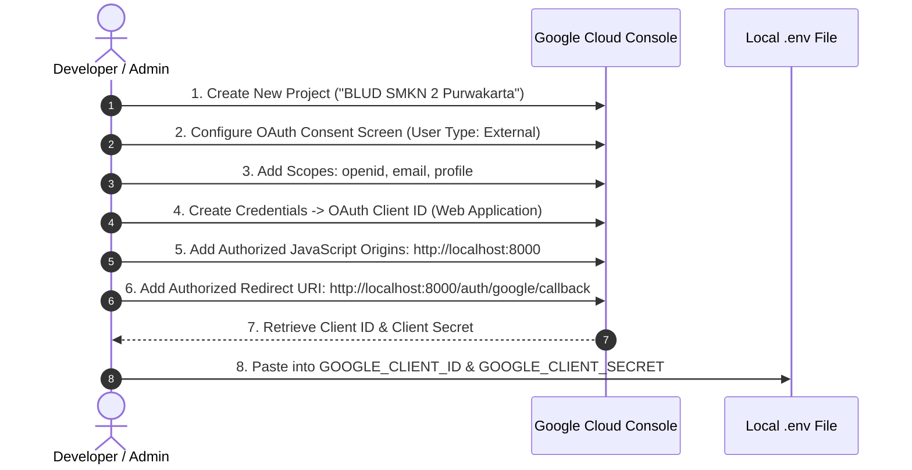

# Installation & Configuration Guide (Setup) - BLUD SMKN 2 Purwakarta

This document provides a comprehensive, step-by-step guide for installation, environment setup, Google Cloud Console OAuth 2.0 configuration, and troubleshooting for the **BLUD SMKN 2 Purwakarta** information system.

---

## 1. System Requirements

Before starting the installation process, ensure that your computer or server environment meets the following specifications:

- **Operating System**: Windows 10/11, Linux (Ubuntu/Debian/CentOS), or macOS.
- **PHP**: Version `8.2` or `8.3+` (PHP 8.3 recommended).
  - *Required PHP Extensions*: `pdo_mysql`, `mbstring`, `openssl`, `fileinfo`, `curl`, `gd`, `intl`, `xml`, `bcmath`.
- **Database**: MySQL `8.0+` or MariaDB `10.4+`.
- **Composer**: Composer version `2.x+`.
- **Node.js & NPM**: Node.js version `18.x`, `20.x`, or `22.x LTS` with NPM `9.x+`.
- **Local Web Server (Optional)**: Laragon, XAMPP, or Laravel Herd.
- **Git**: Version 2.x+.

---

## 2. Step-by-Step Installation

### Step 1: Clone the Project Repository
Open terminal / PowerShell and navigate to your workspace directory:
```bash
git clone https://github.com/zan-ux/BLUD_SMKN2PURWAKARTA.git BLUDSMEKDA
cd BLUDSMEKDA
```

### Step 2: Install Backend Dependencies (PHP / Composer)
```bash
composer install
```

### Step 3: Install Frontend Dependencies (Node.js / NPM)
```bash
npm install
```

### Step 4: Duplicate Environment Configuration File (`.env`)
Copy the sample `.env.example` file to create your active `.env` configuration:
- **Windows (PowerShell)**:
  ```powershell
  copy .env.example .env
  ```
- **Linux / macOS (Bash)**:
  ```bash
  cp .env.example .env
  ```

### Step 5: Generate Application Encryption Key
```bash
php artisan key:generate
```

---

## 3. Configuring the `.env` File

Open the `.env` file using a text editor (VS Code, Antigravity, etc.) and configure the following parameters:

### 3.1. Application Settings
```env
APP_NAME="BLUD SMKN 2 Purwakarta"
APP_ENV=local
APP_KEY=base64:... (Automatically generated by key:generate)
APP_DEBUG=true
APP_TIMEZONE=Asia/Jakarta
APP_URL=http://localhost:8000
```

### 3.2. Database Configuration (MySQL Database)
Create a new MySQL database (e.g., via phpMyAdmin or HeidiSQL) named `blud_smkn2`, then configure:
```env
DB_CONNECTION=mysql
DB_HOST=127.0.0.1
DB_PORT=3306
DB_DATABASE=blud_smkn2
DB_USERNAME=root
DB_PASSWORD=
```

### 3.3. Google OAuth 2.0 Settings (Single Sign-On)
```env
GOOGLE_CLIENT_ID="YOUR_GOOGLE_CLIENT_ID.apps.googleusercontent.com"
GOOGLE_CLIENT_SECRET="YOUR_GOOGLE_CLIENT_SECRET"
GOOGLE_REDIRECT_URI="${APP_URL}/auth/google/callback"
```

---

## 4. Google Cloud Console OAuth 2.0 Setup Guide

To enable the **Sign in with Google (SSO)** feature, follow these steps to register your OAuth credentials:



### Step-by-Step Inputs in Google Cloud Console:
1. Go to the [Google Cloud Console](https://console.cloud.google.com/).
2. Create a new project or select an existing one.
3. Navigate to **APIs & Services** > **OAuth consent screen**:
   - Select user type: **External**.
   - Enter App name: `BLUD SMKN 2 Purwakarta`.
   - Fill in User support email & Developer contact info.
   - Under **Scopes**, ensure `.../auth/userinfo.email`, `.../auth/userinfo.profile`, and `openid` are selected.
4. Navigate to **Credentials** > **Create Credentials** > **OAuth Client ID**:
   - Application type: **Web application**.
   - Name: `BLUD Web Client`.
   - **Authorized JavaScript origins**:
     - `http://localhost:8000`
     - `http://127.0.0.1:8000`
   - **Authorized redirect URIs**:
     - `http://localhost:8000/auth/google/callback`
     - `http://127.0.0.1:8000/auth/google/callback`
5. Click **Create**, then copy the **Client ID** and **Client Secret** into your `.env` file.

---

## 5. Database Migration & Initial Data Seeding

Run the migration command to construct the table schema and populate seed data (institutional profile, categories, demo accounts):
```bash
php artisan migrate:fresh --seed
```

### Default Accounts for Testing:
| Role | Email Address | Password | Permissions |
|---|---|---|---|
| **Super Admin** | `admin@smkn2purwakarta.sch.id` | `password` | Full access to `/admin` dashboard |
| **Viewer / Public** | `viewer@smkn2purwakarta.sch.id` | `password` | Access to public portal |

---

## 6. Storage Link & Asset Building

### 6.1. Create Storage Symbolic Link
This command links uploaded files in `storage/app/public` to `public/storage` so they can be accessed via the browser:
```bash
php artisan storage:link
```

### 6.2. Compile Frontend Assets (Tailwind CSS v4 & Vite)
- **For Production Mode (*Production Bundle*)**:
  ```bash
  npm run build
  ```
- **For Active Development Mode (*Hot Reload / Dev Server*)**:
  ```bash
  npm run dev
  ```

---

## 7. Running the Local Server

Open two terminal windows to run the application server and the frontend compiler concurrently:

**Terminal 1 (Laravel Backend Server)**:
```bash
php artisan serve
```
> The server will run at: `http://localhost:8000`

**Terminal 2 (Vite Hot Module Replacement - Optional during development)**:
```bash
npm run dev
```

Open your browser and visit `http://localhost:8000`.

---

## 8. Common Troubleshooting Solutions

### Issue 1: Images for services/facilities/logos do not appear (404 Error on `/storage/...`)
- **Cause**: The storage symbolic link has not been created or was broken.
- **Solution**:
  ```bash
  php artisan storage:link
  ```
  *(On Windows, ensure terminal is run with sufficient administrative permissions if symlink creation fails).*

### Issue 2: cURL 60 SSL Certificate Error when Signing in with Google
- **Cause**: PHP on Windows does not have a registered CA certificate file (`cacert.pem`).
- **Solution**: In `GoogleAuthController.php`, HTTP requests already include `Http::withOptions(['verify' => false])` for local development. Alternatively, download `cacert.pem` from curl.se and configure `curl.cainfo = "C:\path\to\cacert.pem"` in `php.ini`.

### Issue 3: Database Connection Failed (*SQLSTATE[HY000] [2002] Connection refused*)
- **Cause**: The MySQL server is not running or is configured on a different port.
- **Solution**: Make sure the MySQL service in Laragon/XAMPP is in *Running* state, verify the port in `.env` (usually `3306`), and confirm that the `blud_smkn2` database has been created.

### Issue 4: Tailwind CSS Changes are Not Reflected
- **Cause**: Vite development server is not running or Blade view caches are outdated.
- **Solution**:
  ```bash
  php artisan view:clear
  php artisan cache:clear
  npm run build
  ```
