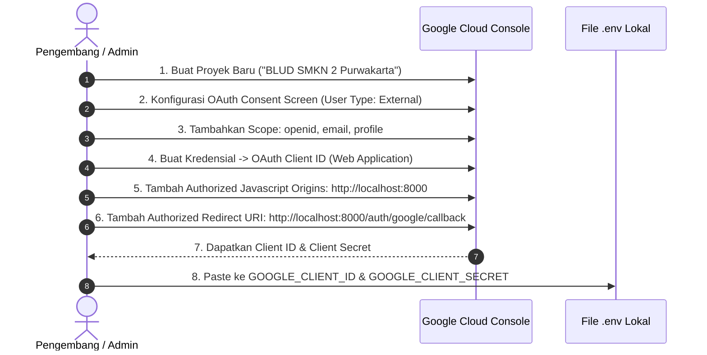

#  Panduan Instalasi & Konfigurasi (Setup) - BLUD SMKN 2 Purwakarta

Dokumen ini memuat panduan lengkap langkah demi langkah (*step-by-step*) untuk melakukan instalasi, konfigurasi lingkungan (*environment setup*), konfigurasi Google Cloud Console OAuth, serta pemecahan masalah (*troubleshooting*) pada sistem informasi **BLUD SMKN 2 Purwakarta**.

---

##  1. Prasyarat Sistem (System Requirements)

Sebelum memulai proses instalasi, pastikan lingkungan komputer server atau lokal Anda telah memenuhi spesifikasi berikut:

- **Sistem Operasi**: Windows 10/11, Linux (Ubuntu/Debian/CentOS), atau macOS.
- **PHP**: Versi `8.2` atau `8.3+` (Disarankan PHP 8.3).
  - *Ekstensi PHP wajib aktif*: `pdo_mysql`, `mbstring`, `openssl`, `fileinfo`, `curl`, `gd`, `intl`, `xml`, `bcmath`.
- **Database**: MySQL `8.0+` atau MariaDB `10.4+`.
- **Composer**: Composer versi `2.x+`.
- **Node.js & NPM**: Node.js versi `18.x`, `20.x`, atau `22.x LTS` beserta NPM `9.x+`.
- **Web Server Lokal (Opsional)**: Laragon, XAMPP, atau Laravel Herd.
- **Git**: Versi 2.x+.

---

##  2. Langkah-Langkah Instalasi (Step-by-Step)

### Langkah 1: Clone Repository Proyek
Buka terminal / PowerShell dan arahkan ke direktori kerja Anda:
```bash
git clone https://github.com/zan-ux/BLUD_SMKN2PURWAKARTA.git BLUDSMEKDA
cd BLUDSMEKDA
```

### Langkah 2: Instal Dependensi Backend (PHP / Composer)
```bash
composer install
```

### Langkah 3: Instal Dependensi Frontend (Node.js / NPM)
```bash
npm install
```

### Langkah 4: Duplikasi Berkas Konfigurasi Lingkungan (`.env`)
Salin berkas contoh `.env.example` menjadi berkas konfigurasi aktif `.env`:
- **Windows (PowerShell)**:
  ```powershell
  copy .env.example .env
  ```
- **Linux / macOS (Bash)**:
  ```bash
  cp .env.example .env
  ```

### Langkah 5: Generate Application Encryption Key
```bash
php artisan key:generate
```

---

##  3. Konfigurasi Berkas `.env`

Buka berkas `.env` menggunakan editor teks (VS Code, Antigravity, dll.) dan sesuaikan parameter berikut:

### 3.1. Pengaturan Aplikasi
```env
APP_NAME="BLUD SMKN 2 Purwakarta"
APP_ENV=local
APP_KEY=base64:... (Otomatis dari perintah key:generate)
APP_DEBUG=true
APP_TIMEZONE=Asia/Jakarta
APP_URL=http://localhost:8000
```

### 3.2. Pengaturan Basis Data (Database MySQL)
Buat basis data baru di MySQL (misalnya melalui phpMyAdmin atau HeidiSQL) bernama `blud_smkn2`, lalu sesuaikan:
```env
DB_CONNECTION=mysql
DB_HOST=127.0.0.1
DB_PORT=3306
DB_DATABASE=blud_smkn2
DB_USERNAME=root
DB_PASSWORD=
```

### 3.3. Pengaturan Google OAuth 2.0 (Single Sign-On)
```env
GOOGLE_CLIENT_ID="ISI_DENGAN_GOOGLE_CLIENT_ID_ANDA.apps.googleusercontent.com"
GOOGLE_CLIENT_SECRET="ISI_DENGAN_GOOGLE_CLIENT_SECRET_ANDA"
GOOGLE_REDIRECT_URI="${APP_URL}/auth/google/callback"
```

---

##  4. Panduan Setup Google Cloud Console OAuth 2.0

Untuk mengaktifkan fitur **Login dengan Google SSO**, ikuti langkah pendaftaran kredensial berikut:



### Rincian Input pada Google Cloud Console:
1. Akses [Google Cloud Console](https://console.cloud.google.com/).
2. Buat proyek baru atau pilih proyek yang sudah ada.
3. Masuk ke menu **APIs & Services** > **OAuth consent screen**:
   - Pilih jenis pengguna: **External**.
   - Masukkan App name: `BLUD SMKN 2 Purwakarta`.
   - Masukkan User support email & Developer contact info.
   - Pada bagian **Scopes**, pastikan mencakup `.../auth/userinfo.email`, `.../auth/userinfo.profile`, dan `openid`.
4. Masuk ke menu **Credentials** > **Create Credentials** > **OAuth Client ID**:
   - Application type: **Web application**.
   - Name: `BLUD Web Client`.
   - **Authorized JavaScript origins**:
     - `http://localhost:8000`
     - `http://127.0.0.1:8000`
   - **Authorized redirect URIs**:
     - `http://localhost:8000/auth/google/callback`
     - `http://127.0.0.1:8000/auth/google/callback`
5. Klik **Create**, lalu salin **Client ID** dan **Client Secret** ke file `.env`.

---

##  5. Migrasi & Seeding Data Awal

Jalankan perintah migrasi skema tabel sekaligus mengisi data bawaan profil instansi, kategori, dan akun demo:
```bash
php artisan migrate:fresh --seed
```

###  Akun Bawaan untuk Pengujian:
| Peran (Role) | Alamat Email | Kata Sandi | Hak Akses |
|---|---|---|---|
| **Super Admin** | `admin@smkn2purwakarta.sch.id` | `password` | Akses penuh dashboard `/admin` |
| **Viewer / Publik** | `viewer@smkn2purwakarta.sch.id` | `password` | Akses portal publik |

---

##  6. Pembuatan Storage Link & Build Aset

### 6.1. Buat Symbolic Link Direktori Berkas
Perintah ini menghubungkan berkas unggahan di `storage/app/public` agar dapat diakses dari browser melalui `public/storage`:
```bash
php artisan storage:link
```

### 6.2. Kompilasi Aset Frontend (Tailwind CSS v4 & Vite)
- **Untuk Mode Produksi (*Production Bundle*)**:
  ```bash
  npm run build
  ```
- **Untuk Mode Pengembangan Aktif (*Hot Reload / Dev Server*)**:
  ```bash
  npm run dev
  ```

---

##  7. Menjalankan Server Lokal

Buka dua jendela terminal untuk menjalankan server aplikasi dan server kompilasi frontend:

**Terminal 1 (Server Laravel Backend)**:
```bash
php artisan serve
```
> Server berjalan pada URL: `http://localhost:8000`

**Terminal 2 (Vite Hot Module Replacement - Opsional saat dev)**:
```bash
npm run dev
```

Buka peramban (*browser*) dan akses `http://localhost:8000`.

---

##  8. Solusi Masalah Umum (Troubleshooting)

###  Masalah 1: Gambar layanan/fasilitas/logo tidak muncul (Error 404 pada URL `/storage/...`)
- **Penyebab**: Symbolic link penyimpanan belum dibuat atau terputus.
- **Solusi**:
  ```bash
  php artisan storage:link
  ```
  *(Pada Windows, pastikan terminal dijalankan dengan hak akses yang memadai jika symlink gagal).*

###  Masalah 2: Error cURL 60 SSL Certificate saat Login dengan Google
- **Penyebab**: PHP di Windows tidak memiliki berkas sertifikat CA terdaftar (`cacert.pem`).
- **Solusi**: Di `GoogleAuthController.php`, pemanggilan HTTP sudah dilengkapi opsi `Http::withOptions(['verify' => false])` untuk lingkungan lokal, atau unduh `cacert.pem` dari curl.se dan atur `curl.cainfo = "C:\path\to\cacert.pem"` di `php.ini`.

###  Masalah 3: Gagal koneksi basis data (*SQLSTATE[HY000] [2002] Connection refused*)
- **Penyebab**: Server MySQL belum berjalan atau port berbeda.
- **Solusi**: Pastikan service MySQL di Laragon/XAMPP sudah dalam kondisi *Running*, periksa port di `.env` (biasanya `3306`), dan pastikan database `blud_smkn2` sudah dibuat.

###  Masalah 4: Perubahan CSS Tailwind tidak terdeteksi
- **Penyebab**: Server Vite belum di-refresh atau cache view Blade masih menyimpan tampilan lama.
- **Solusi**:
  ```bash
  php artisan view:clear
  php artisan cache:clear
  npm run build
  ```
